---
## Front matter
title: "Лабораторная работа №2"
subtitle: "Git"
author: "Солдатов Алексей Евгеньевич"

## Generic otions
lang: ru-RU
toc-title: "Содержание"

## Bibliography
bibliography: bib/cite.bib
csl: pandoc/csl/gost-r-7-0-5-2008-numeric.csl

## Pdf output format
toc: true # Table of contents
toc-depth: 2
lof: true # List of figures
lot: true # List of tables
fontsize: 12pt
linestretch: 1.5
papersize: a4
documentclass: scrreprt
## I18n polyglossia
polyglossia-lang:
  name: russian
  options:
	- spelling=modern
	- babelshorthands=true
polyglossia-otherlangs:
  name: english
## I18n babel
babel-lang: russian
babel-otherlangs: english
## Fonts
mainfont: PT Serif
romanfont: PT Serif
sansfont: PT Sans
monofont: PT Mono
mainfontoptions: Ligatures=TeX
romanfontoptions: Ligatures=TeX
sansfontoptions: Ligatures=TeX,Scale=MatchLowercase
monofontoptions: Scale=MatchLowercase,Scale=0.9
## Biblatex
biblatex: true
biblio-style: "gost-numeric"
biblatexoptions:
  - parentracker=true
  - backend=biber
  - hyperref=auto
  - language=auto
  - autolang=other*
  - citestyle=gost-numeric
## Pandoc-crossref LaTeX customization
figureTitle: "Рис."
tableTitle: "Таблица"
listingTitle: "Листинг"
lofTitle: "Список иллюстраций"
lotTitle: "Список таблиц"
lolTitle: "Листинги"
## Misc options
indent: true
header-includes:
  - \usepackage{indentfirst}
  - \usepackage{float} # keep figures where there are in the text
  - \floatplacement{figure}{H} # keep figures where there are in the text
---

# Цель работы

Целью данной работы является изучение идеологии и применение средств
контроля версий. А также приобретение практических навыков по работе с
системой git.

# Задание

1. Настройка gitgub.
2. Базовая настройка git.
3. Создание SSH ключа.
4. Создание рабочего пространства и репозитория курса на основе шаблона.
5. Создание репозитория курса на основе шаблона
6. Настройка каталога курса
7. Выполнение заданий для самостоятельной работы.

# Теоретическое введение

Здесь описываются теоретические аспекты, связанные с выполнением работы.

Например, в табл. @tbl:std-dir приведено краткое описание стандартных каталогов Unix.

: Описание некоторых каталогов файловой системы GNU Linux {#tbl:std-dir}

| Имя каталога | Описание каталога                                                                                                          |
|--------------|----------------------------------------------------------------------------------------------------------------------------|
| `/`          | Корневая директория, содержащая всю файловую                                                                               |
| `/bin `      | Основные системные утилиты, необходимые как в однопользовательском режиме, так и при обычной работе всем пользователям     |
| `/etc`       | Общесистемные конфигурационные файлы и файлы конфигурации установленных программ                                           |
| `/home`      | Содержит домашние директории пользователей, которые, в свою очередь, содержат персональные настройки и данные пользователя |
| `/media`     | Точки монтирования для сменных носителей                                                                                   |
| `/root`      | Домашняя директория пользователя  `root`                                                                                   |
| `/tmp`       | Временные файлы                                                                                                            |
| `/usr`       | Вторичная иерархия для данных пользователя                                                                                 |

Более подробно об Unix см. в [@gnu-doc:bash;@newham:2005:bash;@zarrelli:2017:bash;@robbins:2013:bash;@tannenbaum:arch-pc:ru;@tannenbaum:modern-os:ru].

# Выполнение лабораторной работы

1. Настройка github

Создал учётную запись на сайте https://github.com/ и заполнил основные данные. (рис. @fig:001)

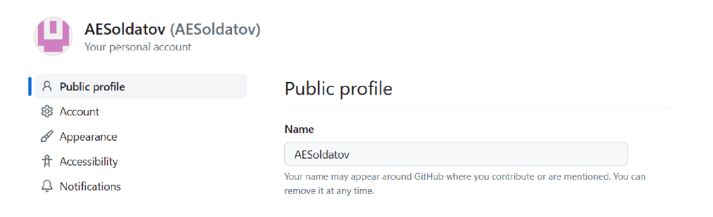{#fig:001 width=70%}

2. Базовая настройка git

Открыл терминал и ввел следующие команды, указав имя и email. (рис. @fig:002)

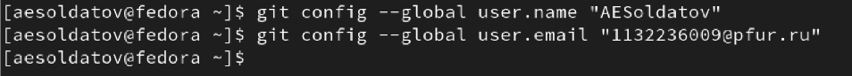{#fig:002 width=70%}

Настраиваю utf-8 в выводе сообщений git и задаю имя начальной ветки “master”. (рис. @fig:003)

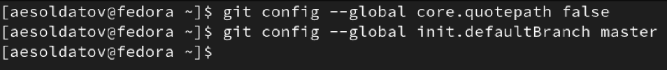{#fig:003 width=70%}

Задаю параметры “autocrlf” и “safecrlf”. (рис. @fig:004)

{#fig:004 width=70%}

3. Создание SSH ключа

Для последующей идентификации пользователя на сервере репозиториев сгенерировал ключ. (рис. @fig:005)

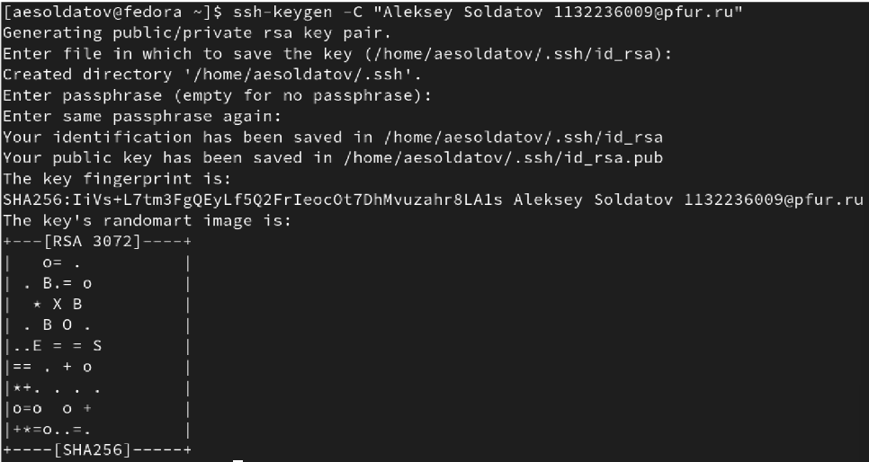{#fig:005 width=70%}

Далее скопировал данный ключ из локальной консоли в буфер обмена и загрузил его на сайт “//github.org/”. (рис. @fig:006), (рис. @fig:007)

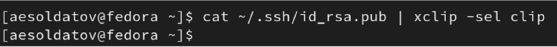{#fig:006 width=70%}

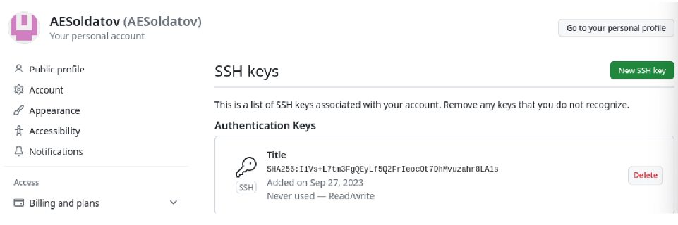{#fig:007 width=70%}

4. Создание рабочего пространства и репозитория курса на основе шаблона

В терминале создал каталог для предмета «Архитектура компьютера». (рис. @fig:008)

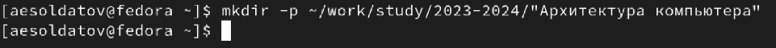{#fig:008 width=70%}

5. Создание репозитория курса на основе шаблона

Перешел по ссылке на страницу с шаблоном курса и скопировал шаблон. (рис. @fig:009)

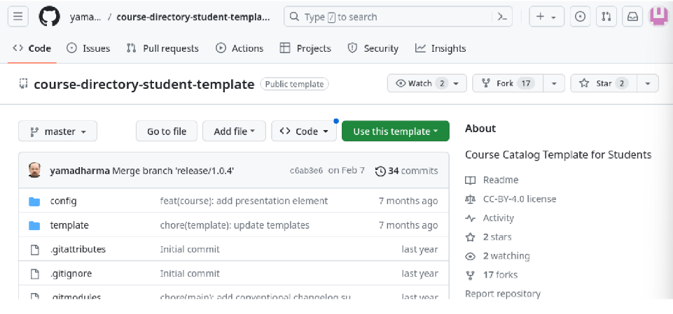{#fig:009 width=70%}

Задал название и создал репозиторий. (рис. @fig:010)

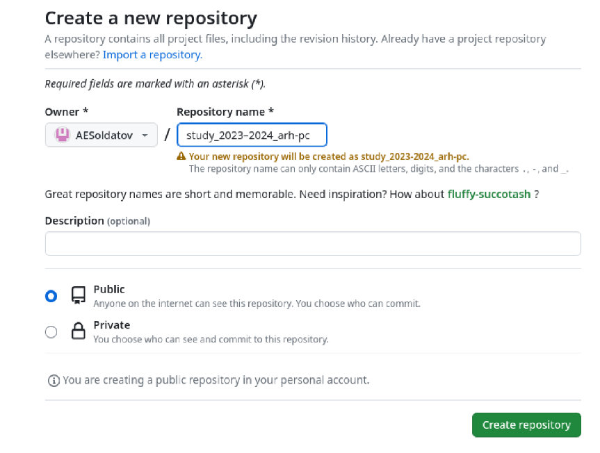{#fig:010 width=70%}

В терминале перешел в каталог курса и клонировал созданный репозиторий. (рис. @fig:011)

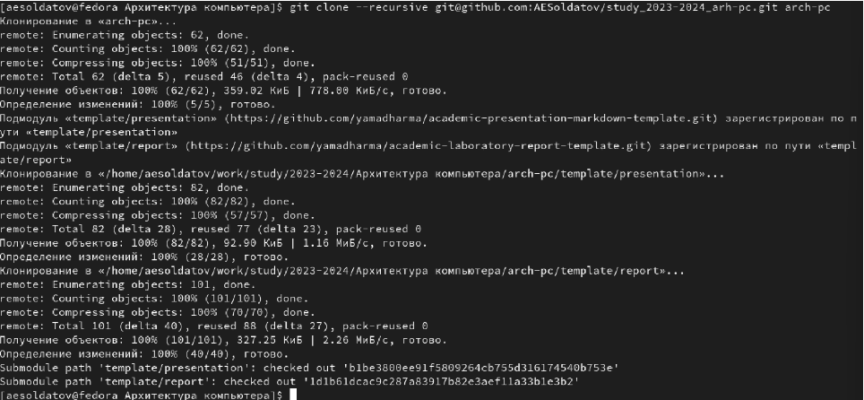{#fig:011 width=70%}

Ссылку для клонирования скопировал на странице созданного репозитория. (рис. @fig:012)

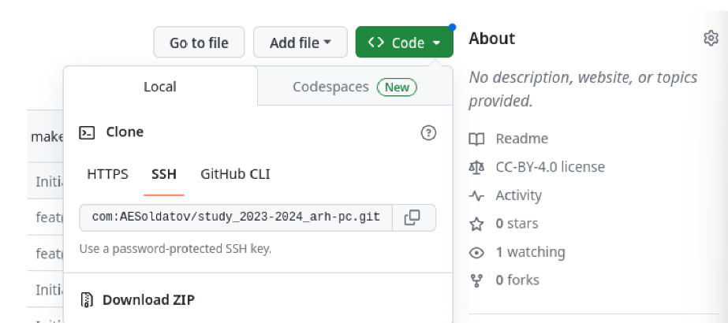{#fig:012 width=70%}

6. Настройка каталога курса

Перешел в каталог курса. (рис. @fig:013)

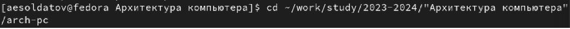{#fig:013 width=70%}

Удалил лишние файлы. (рис. @fig:014)

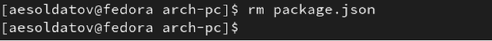{#fig:014 width=70%}

Создал необходимый каталог. (рис. @fig:015)

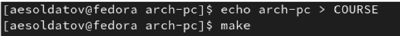{#fig:015 width=70%}

Отправил файлы на сервер. (рис. @fig:016), (рис. @fig:017)

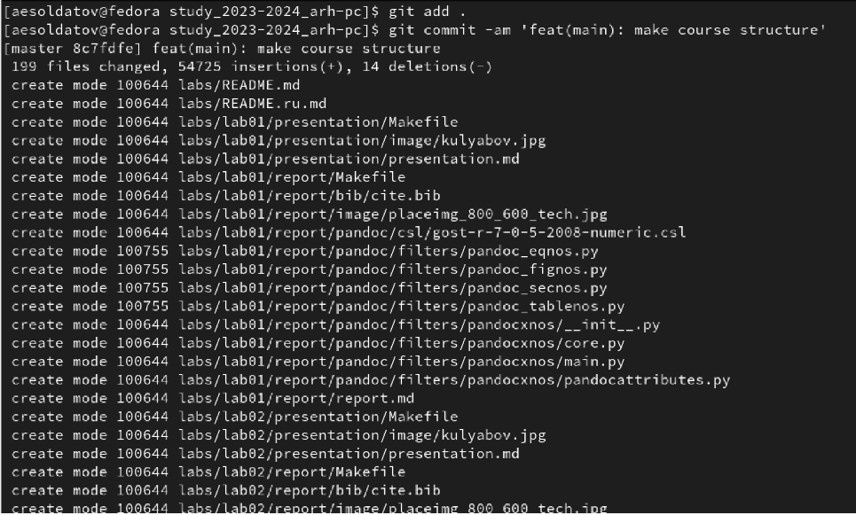{#fig:016 width=70%}

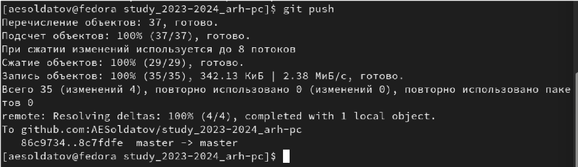{#fig:017 width=70%}

# Выполнение заданий для самостоятельной работы

1. Создание отчета

Использую команду «touch» для создания файла с отчетом в каталоге abs/lab02/report/«Отчет по лаб_раб2». (рис. @fig:018)

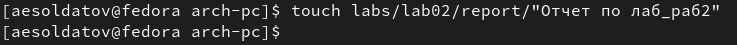{#fig:018 width=70%}

Оформить отчет можно в текстовом процессоре LibreOffice Writer. (рис. @fig:019)

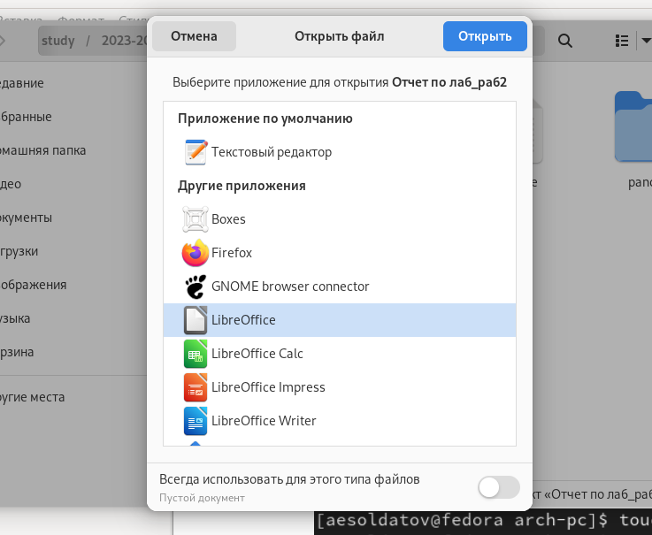{#fig:019 width=70%}

2. Копирование отчетов предыдущих работ

Перехожу в каталог «Загрузки» и копирую от туда предыдущую лабораторную работу в каталог «labs/lab01/report» с помощью команды «cp». (рис. @fig:020)

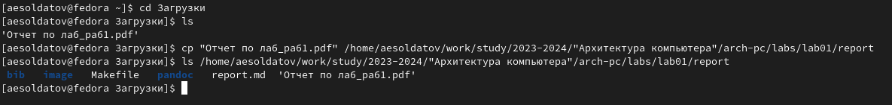{#fig:020 width=70%}

3. Загрузка файлов на github

С помощью команды «git add» добавляю файл с первой лабораторной работой на сервер. (рис. @fig:021)

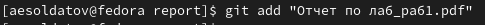{#fig:021 width=70%}

Аналогично загружаю файл со второй лабораторной работой и отправляю файлы на сервер. (рис. @fig:022)

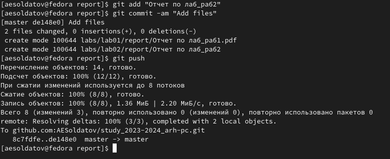{#fig:022 width=70%}

После этого захожу на Github и проверяю наличие обоих документов. (рис. @fig:023), (рис. @fig:024)

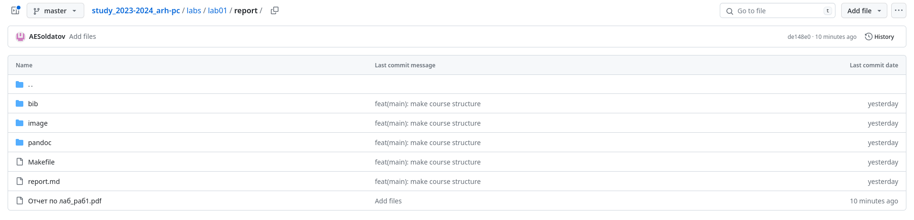{#fig:023 width=70%}

{#fig:024 width=70%}

Все файлы на месте, значит работа выполнена корректно.

# Выводы

В результате лабораторной работы изучил идеологию и применение средств контроля версий. Приобрел практические навыки по работе с системой git.

# Список литературы{.unnumbered}

::: {#refs}
:::
