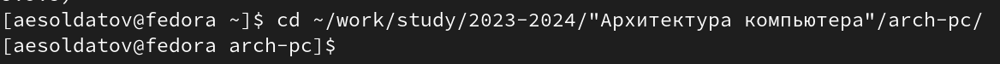
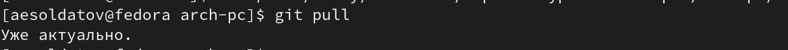
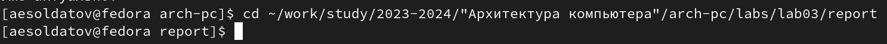
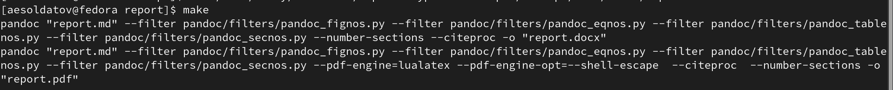
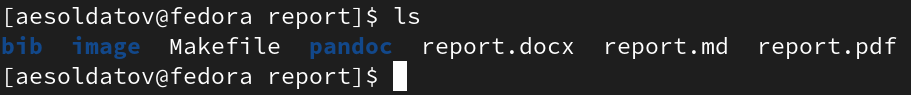
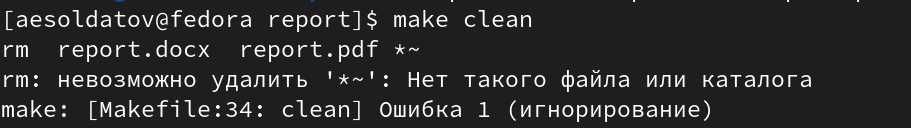
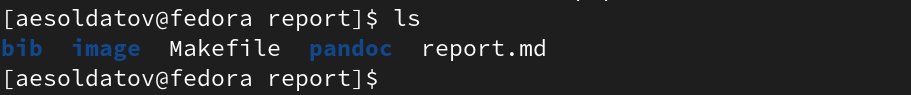
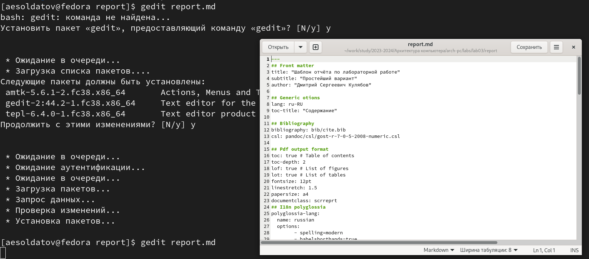

---
## Front matter
title: "Лабораторная работа №3"
subtitle: "Язык разметки Markdown"
author: "Солдатов Алексей"

## Generic otions
lang: ru-RU
toc-title: "Содержание"

## Bibliography
bibliography: bib/cite.bib
csl: pandoc/csl/gost-r-7-0-5-2008-numeric.csl

## Pdf output format
toc: true # Table of contents
toc-depth: 2
lof: true # List of figures
lot: true # List of tables
fontsize: 12pt
linestretch: 1.5
papersize: a4
documentclass: scrreprt
## I18n polyglossia
polyglossia-lang:
  name: russian
  options:
	- spelling=modern
	- babelshorthands=true
polyglossia-otherlangs:
  name: english
## I18n babel
babel-lang: russian
babel-otherlangs: english
## Fonts
mainfont: PT Serif
romanfont: PT Serif
sansfont: PT Sans
monofont: PT Mono
mainfontoptions: Ligatures=TeX
romanfontoptions: Ligatures=TeX
sansfontoptions: Ligatures=TeX,Scale=MatchLowercase
monofontoptions: Scale=MatchLowercase,Scale=0.9
## Biblatex
biblatex: true
biblio-style: "gost-numeric"
biblatexoptions:
  - parentracker=true
  - backend=biber
  - hyperref=auto
  - language=auto
  - autolang=other*
  - citestyle=gost-numeric
## Pandoc-crossref LaTeX customization
figureTitle: "Рис."
tableTitle: "Таблица"
listingTitle: "Листинг"
lofTitle: "Список иллюстраций"
lotTitle: "Список таблиц"
lolTitle: "Листинги"
## Misc options
indent: true
header-includes:
  - \usepackage{indentfirst}
  - \usepackage{float} # keep figures where there are in the text
  - \floatplacement{figure}{H} # keep figures where there are in the text
---

# Цель работы

Целью данной работы является освоение процедуры оформления отчетов с помощью легковесного
языка разметки Markdown.

# Задание

1. Выполнение заданий лобораторной работы
2. Выполнение заданий для самостоятельной работы

# Теоретическое введение

Здесь описываются теоретические аспекты, связанные с выполнением работы.

Например, в табл. @tbl:std-dir приведено краткое описание стандартных каталогов Unix.

: Описание некоторых каталогов файловой системы GNU Linux {#tbl:std-dir}

| Имя каталога | Описание каталога                                                                                                          |
|--------------|----------------------------------------------------------------------------------------------------------------------------|
| `/`          | Корневая директория, содержащая всю файловую                                                                               |
| `/bin `      | Основные системные утилиты, необходимые как в однопользовательском режиме, так и при обычной работе всем пользователям     |
| `/etc`       | Общесистемные конфигурационные файлы и файлы конфигурации установленных программ                                           |
| `/home`      | Содержит домашние директории пользователей, которые, в свою очередь, содержат персональные настройки и данные пользователя |
| `/media`     | Точки монтирования для сменных носителей                                                                                   |
| `/root`      | Домашняя директория пользователя  `root`                                                                                   |
| `/tmp`       | Временные файлы                                                                                                            |
| `/usr`       | Вторичная иерархия для данных пользователя                                                                                 |

Более подробно об Unix см. в [@gnu-doc:bash;@newham:2005:bash;@zarrelli:2017:bash;@robbins:2013:bash;@tannenbaum:arch-pc:ru;@tannenbaum:modern-os:ru].

# Выполнение лабораторной работы

1. Открыл терминал и перешел в каталог сформированный при выполнении лабораторной работы №2 (рис. [-@fig:001])

{#fig:001 width=70%}

Обновил локальный репозиторий, скачав изменения из удаленного репозитория с помощью комманды "git pull" (рис. [-@fig:002])

{#fig:002 width=70%}

2. Перешел в каталог с шаблоном отчета по лабораторной работе №3 (рис. [-@fig:003])

{#fig:003 width=70%}

3. Провел компиляцию шаблона с использованием Makefile. Для этого ввел команду "make" (рис. [-@fig:004])

{#fig:004 width=70%}

Убедился, что появились нужные файлы (рис. [-@fig:005])

{#fig:005 width=70%}

4. Удалил созданные файлы с помощью команды "make clean" (рис. [-@fig:006])

{#fig:006 width=70%}

Убедился, что были удалены нужные файлы (рис. [-@fig:007])

{#fig:007 width=70%}

5. Открыл файл "report.md" с помощью текстового редактора "geВ соответствующdit" и изучил структуру файла (рис. [-@fig:008])

{#fig:008 width=70%}

6. Заполнил отчет (рис. [-@fig:009])

{#fig:009 width=70%}

Скомпилировал его с помощью команды "make" (рис. [-@fig:010])

{#fig:010 width=70%}

Проверил корректность полученных файлов (рис. [-@fig:011]), (рис. [-@fig:012])

{#fig:011 width=70%}

{#fig:012 width=70%}

7. Загрузил файлы на Github (рис. [-@fig:013])

{#fig:013 width=70%}

Проверил выполнилась комманда (рис. [-@fig:014])

{#fig:014 width=70%}

# Выполнение заданий для самостоятельной работы

1. В каталоге со второй лабораторной работой заполнил шаблон с отчетом (рис. [-@fig:015])

{#fig:015 width=70%}

Создал нужные форматы отчета с помощью команды "make" и убедился в их наличии (рис. [-@fig:016])

{#fig:016 width=70%}

2. Загрузил файлы на github. (рис. [-@fig:017])

{#fig:017 width=70%}

Убедился, что все выполненно корректно. (рис. [-@fig:018])

{#fig:018 width=70%}

# Выводы

Освоил процедуры оформления отчетов с помощью языка разметки Markdown

# Список литературы{.unnumbered}

::: {#refs}
:::
