---
## Front matter
title: "Лабораторная работа №5"
subtitle: "Язык разметки Markdown"
author: "Солдатов Алексей"

## Generic otions
lang: ru-RU
toc-title: "Содержание"

## Bibliography
bibliography: bib/cite.bib
csl: pandoc/csl/gost-r-7-0-5-2008-numeric.csl

## Pdf output format
toc: true # Table of contents
toc-depth: 2
lof: true # List of figures
lot: true # List of tables
fontsize: 12pt
linestretch: 1.5
papersize: a4
documentclass: scrreprt
## I18n polyglossia
polyglossia-lang:
  name: russian
  options:
	- spelling=modern
	- babelshorthands=true
polyglossia-otherlangs:
  name: english
## I18n babel
babel-lang: russian
babel-otherlangs: english
## Fonts
mainfont: PT Serif
romanfont: PT Serif
sansfont: PT Sans
monofont: PT Mono
mainfontoptions: Ligatures=TeX
romanfontoptions: Ligatures=TeX
sansfontoptions: Ligatures=TeX,Scale=MatchLowercase
monofontoptions: Scale=MatchLowercase,Scale=0.9
## Biblatex
biblatex: true
biblio-style: "gost-numeric"
biblatexoptions:
  - parentracker=true
  - backend=biber
  - hyperref=auto
  - language=auto
  - autolang=other*
  - citestyle=gost-numeric
## Pandoc-crossref LaTeX customization
figureTitle: "Рис."
tableTitle: "Таблица"
listingTitle: "Листинг"
lofTitle: "Список иллюстраций"
lotTitle: "Список таблиц"
lolTitle: "Листинги"
## Misc options
indent: true
header-includes:
  - \usepackage{indentfirst}
  - \usepackage{float} # keep figures where there are in the text
  - \floatplacement{figure}{H} # keep figures where there are in the text
---

# Цель работы

Приобрести практические навыки работы в Midnight Commander. Освоить инструкции языка ассемблера mov и int.

# Задание

1. Основы работы с mc
2. Структура программы на языке ассемблера NASM
3. Подключение внешнего файла
4. Выполнение заданий для самостоятельной работы

# Теоретическое введение

Здесь описываются теоретические аспекты, связанные с выполнением работы.

Например, в табл. @tbl:std-dir приведено краткое описание стандартных каталогов Unix.

: Описание некоторых каталогов файловой системы GNU Linux {#tbl:std-dir}

| Имя каталога | Описание каталога                                                                                                          |
|--------------|----------------------------------------------------------------------------------------------------------------------------|
| `/`          | Корневая директория, содержащая всю файловую                                                                               |
| `/bin `      | Основные системные утилиты, необходимые как в однопользовательском режиме, так и при обычной работе всем пользователям     |
| `/etc`       | Общесистемные конфигурационные файлы и файлы конфигурации установленных программ                                           |
| `/home`      | Содержит домашние директории пользователей, которые, в свою очередь, содержат персональные настройки и данные пользователя |
| `/media`     | Точки монтирования для сменных носителей                                                                                   |
| `/root`      | Домашняя директория пользователя  `root`                                                                                   |
| `/tmp`       | Временные файлы                                                                                                            |
| `/usr`       | Вторичная иерархия для данных пользователя                                                                                 |

Более подробно об Unix см. в [@gnu-doc:bash;@newham:2005:bash;@zarrelli:2017:bash;@robbins:2013:bash;@tannenbaum:arch-pc:ru;@tannenbaum:modern-os:ru].

# Выполнение лабораторной работы

1. Основы работы mc 

Открыл Midnight Commander (рис. @fig;001).

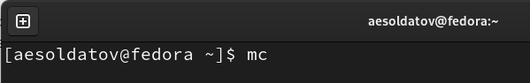{#fig:001 width=70%}

Пользуясь стрелочками перешел в каталог "~/work/arch-pc" и создал там папку "lab05" (рис. @fig:002).

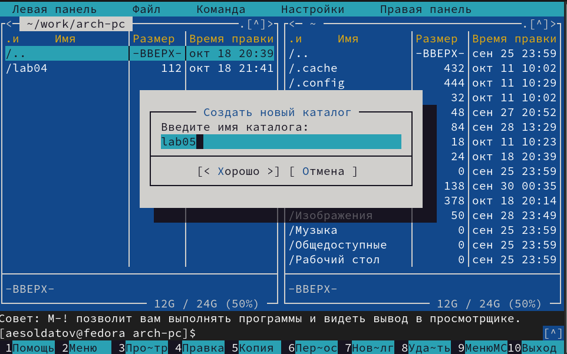{#fig:002 width=70%}

Перешел в созданный каталог и пользуясь строкой ввода создал в нем файл "lab5-1.asm" (рис. @fig:003).

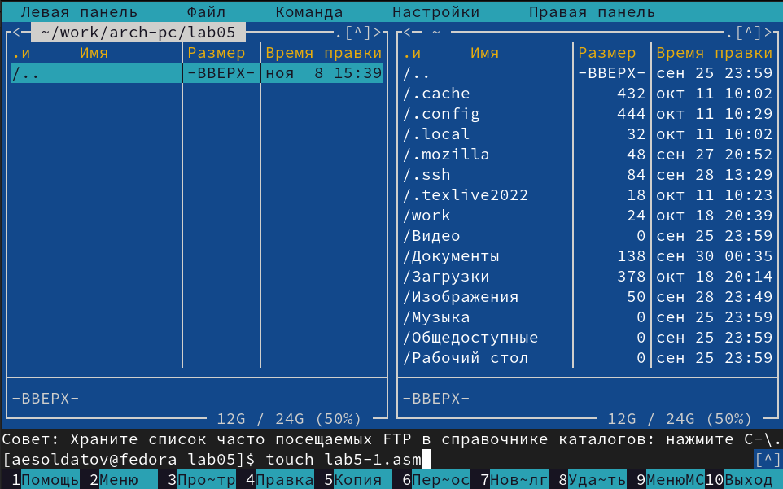{#fig:003 width=70%}

2. Структура программы на языке ассемблера NASM

С помощью клавиши F4 открыл созданный файл и ввел текст программы, сохранил и закрыл его (рис. @fig:004).

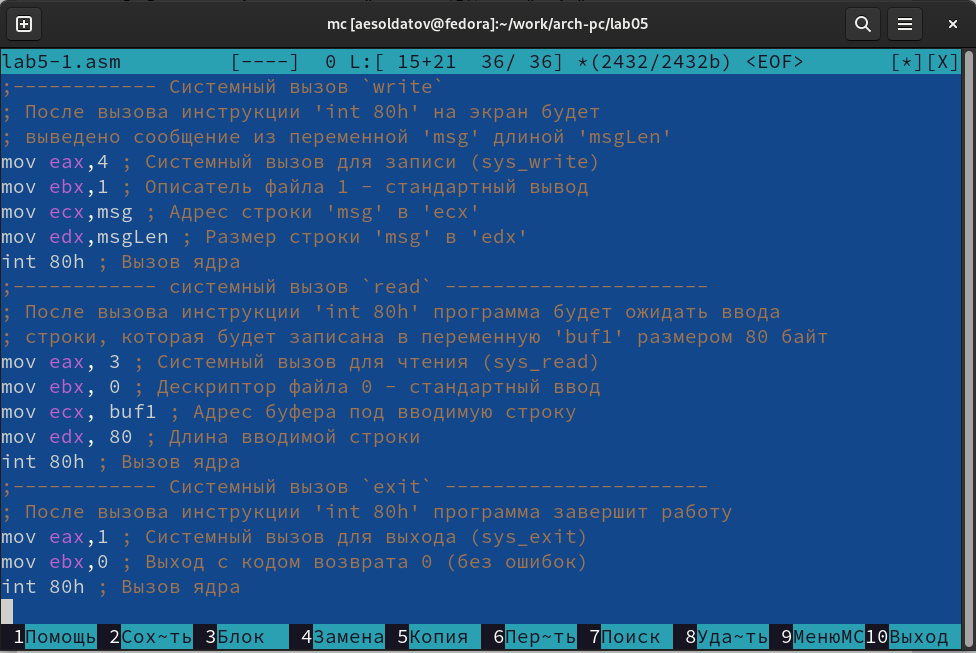{#fig:004 width=70%}

С помощью клавиши F3 откройте файл "lab5-1.asm" для просмотра и убедился, что файл содержит текст программы (рис. @fig:005).

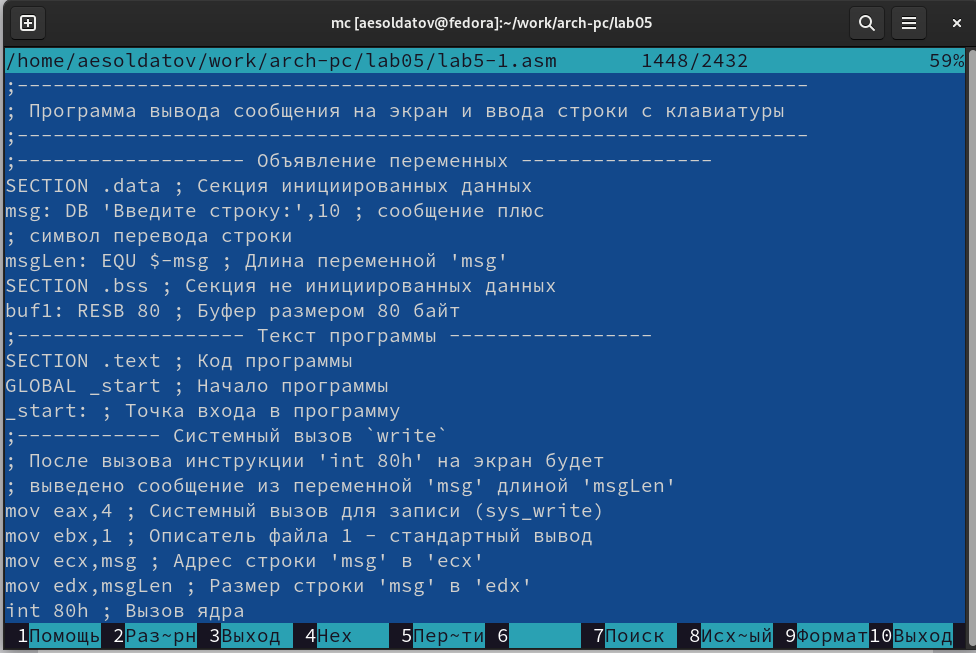{#fig:005 width=70%}

Создал исполняемый файл и запустил его, ввел свои ФИО (рис. @fig:006).

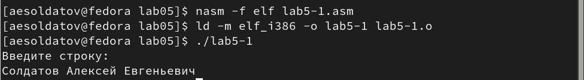{#fig:006 width=70%}

3. Подключение внешнего файла

Скачал файл "in_out.asm" со страницы курса в ТУИС (рис. @fig:007).

{#fig:007 width=70%}

Перенес скачанный файл в каталог с файлом "lab5-1" (рис. @fig:008).

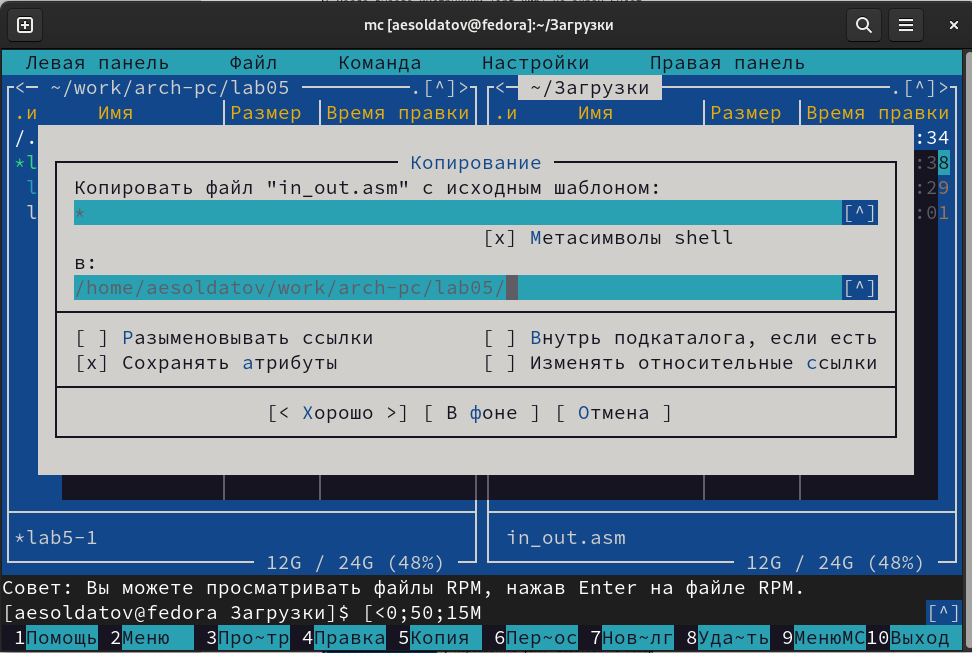{#fig:008 width=70%}

С помощью  клавиши F6 создал копию файла "lab5-1.asm" с именем "lab5-2.asm" (рис. @fig:009).

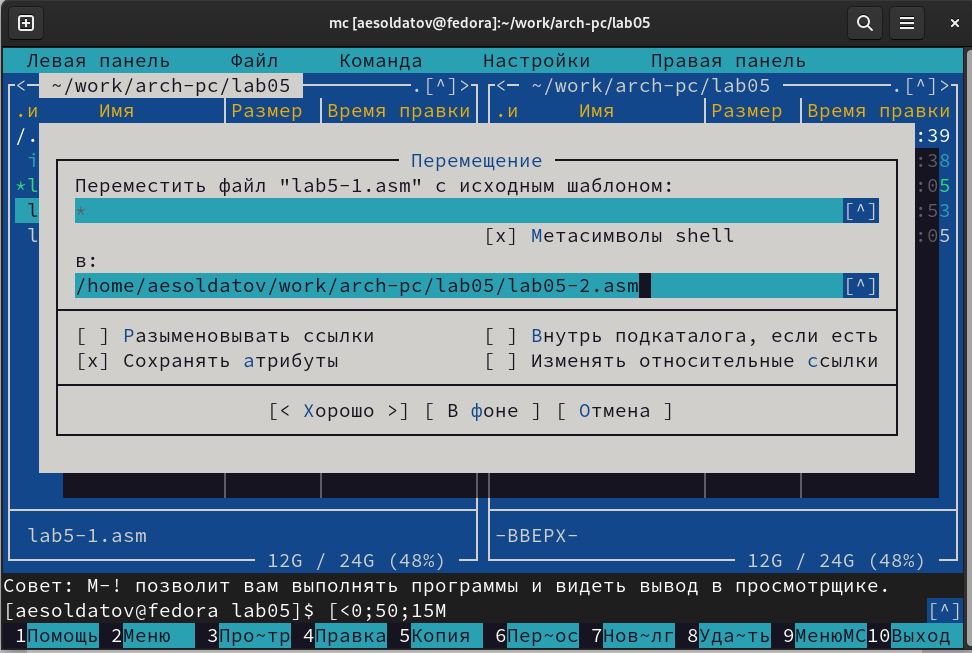{#fig:009 width=70%}

Исправил текст программы в файле "lab5-2.asm", добавив использование подпрограмм из внешнего файла "in_out.asm" (рис. @fig:010).

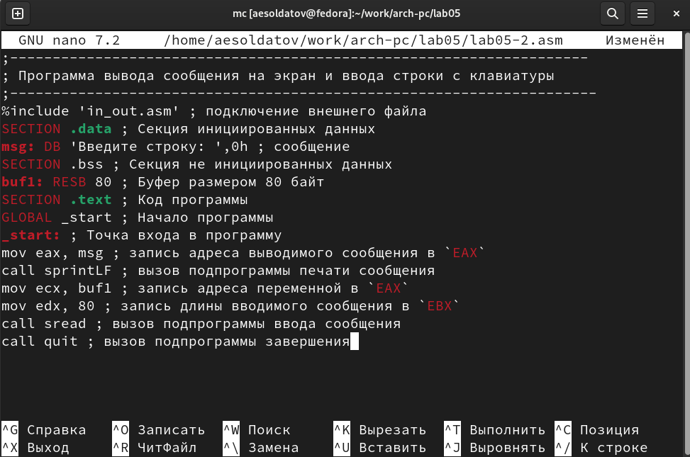{#fig:010 width=70%}

Создал исполняемый файл и проверил его работу (рис. @fig:011).

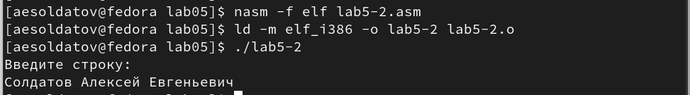{#fig:011 width=70%}

В файле "lab5-2.asm" замените подпрограмму "sprintLF" на "sprint" (рис. @fig:012).

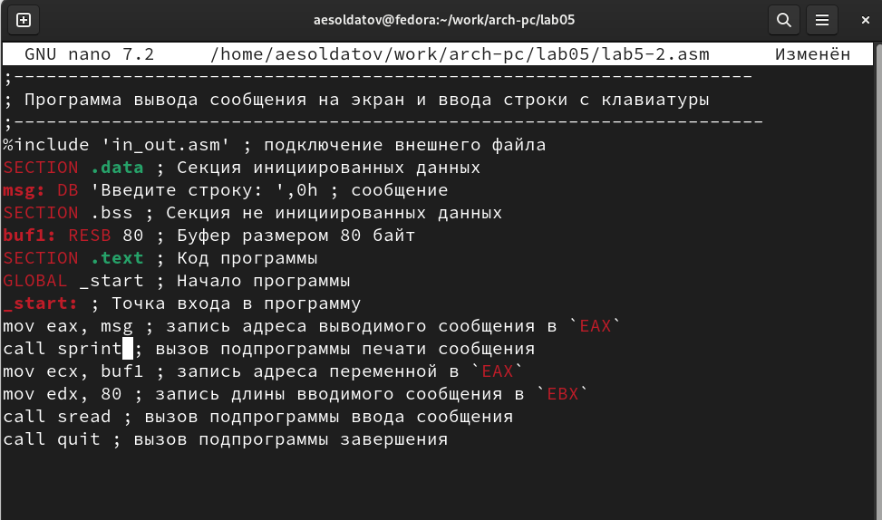{#fig:012 width=70%}

Создал исполняемый файл и проверил его работу (рис. @fig:013).

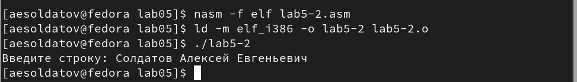{#fig:013 width=70%}

Подпрограмма "sprintLF" запрашивает ввод с новой строки, а "sprint" запрашивает ввод, сохраняя строку

4. Выполнение заданий для самостоятельной работы

Создал копию файла "lab5-1.asm", назвал ее "lab5-1-1.asm" (рис. @fig:014).

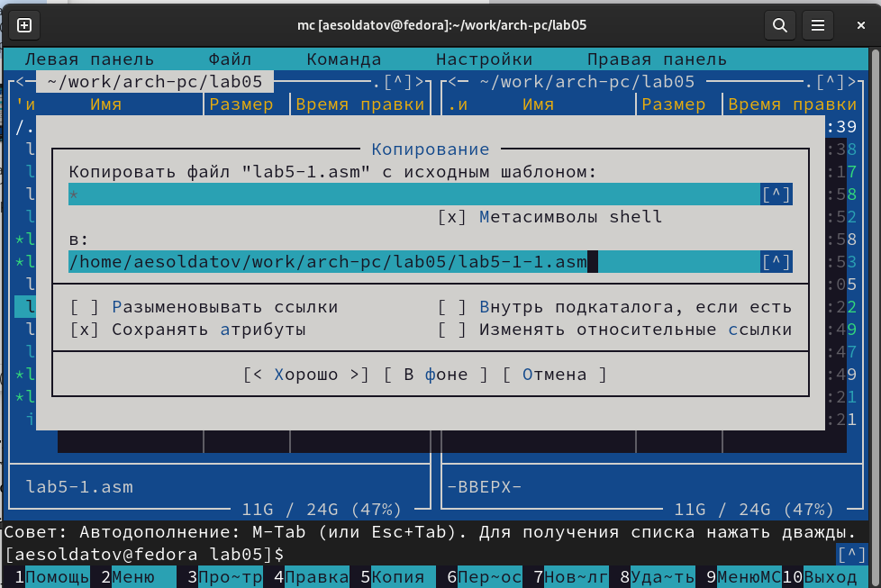{#fig:014 width=70%}

Внес изменения в программу (без использования внешнего файла in_out.asm), так чтобы она работала по алгоритму, заданному в ТУИС (рис. @fig:015).

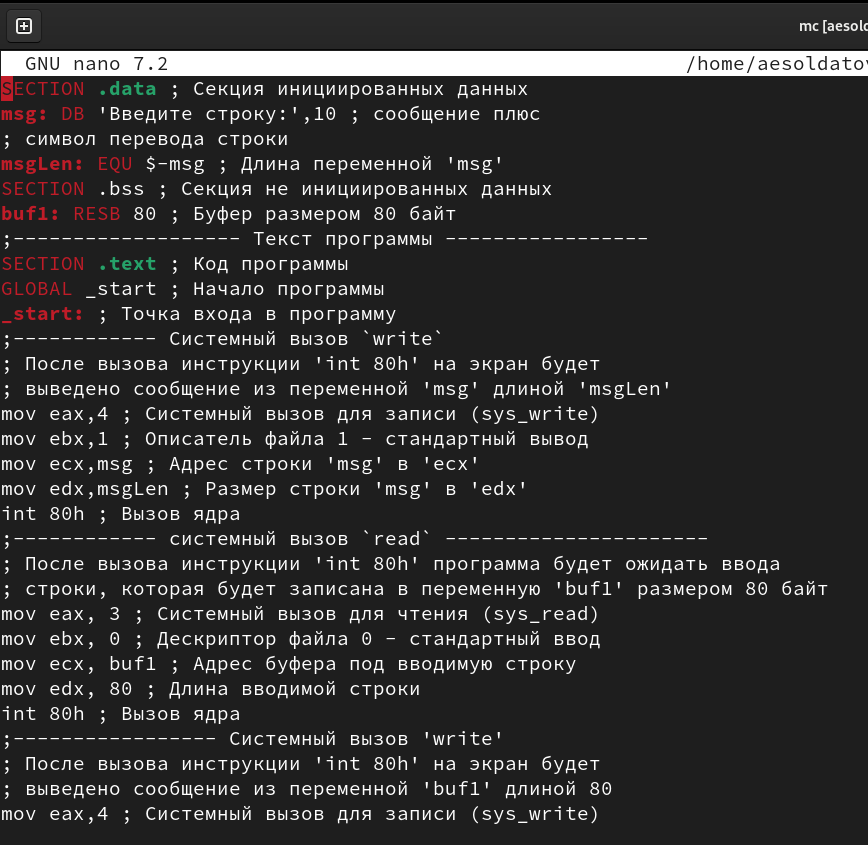{#fig:015 width=70%}

``` NASM
;------------------------------------------------------------------
; Программа вывода сообщения на экран и ввода строки с клавиатуры
;------------------------------------------------------------------
;------------------- Объявление переменных ----------------
SECTION .data ; Секция инициированных данных
msg: DB 'Введите строку:',10 ; сообщение плюс
; символ перевода строки
msgLen: EQU $-msg ; Длина переменной 'msg'
SECTION .bss ; Секция не инициированных данных
buf1: RESB 80 ; Буфер размером 80 байт
;------------------- Текст программы -----------------
SECTION .text ; Код программы
GLOBAL _start ; Начало программы
_start: ; Точка входа в программу
;------------ Cистемный вызов `write`
; После вызова инструкции 'int 80h' на экран будет
; выведено сообщение из переменной 'msg' длиной 'msgLen'
mov eax,4 ; Системный вызов для записи (sys_write)
mov ebx,1 ; Описатель файла 1 - стандартный вывод
mov ecx,msg ; Адрес строки 'msg' в 'ecx'
mov edx,msgLen ; Размер строки 'msg' в 'edx'
int 80h ; Вызов ядра
;------------ системный вызов `read` ----------------------
; После вызова инструкции 'int 80h' программа будет ожидать ввода
; строки, которая будет записана в переменную 'buf1' размером 80 байт
mov eax, 3 ; Системный вызов для чтения (sys_read)
mov ebx, 0 ; Дескриптор файла 0 - стандартный ввод
mov ecx, buf1 ; Адрес буфера под вводимую строку
mov edx, 80 ; Длина вводимой строки
int 80h ; Вызов ядра
;----------------- Системный вызов 'write'
; После вызова инструкции 'int 80h' на экран будет
; выведено сообщение из переменной 'buf1' длиной 80
mov eax,4 ; Системный вызов для записи (sys_write)
mov ebx,1 ; Описатель файла 1 - стандартный вывод
mov ecx,buf1 ; Адрес введенной строки в 'ecx'
mov edx,80 ; Длина введенной строки
int 80h ; Вызов ядра
;------------ Системный вызов `exit` ----------------------
; После вызова инструкции 'int 80h' программа завершит работу
mov eax,1 ; Системный вызов для выхода (sys_exit)
mov ebx,0 ; Выход с кодом возврата 0 (без ошибок)
int 80h ; Вызов ядра
```

Создал исполняемый файл и проверил его работу (рис. @fig:016).

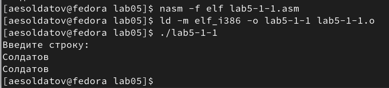{#fig:016 width=70%}

Создал копию файла "lab5-2.asm", назвал ее "lab5-2-1.asm" (рис. @fig:017).

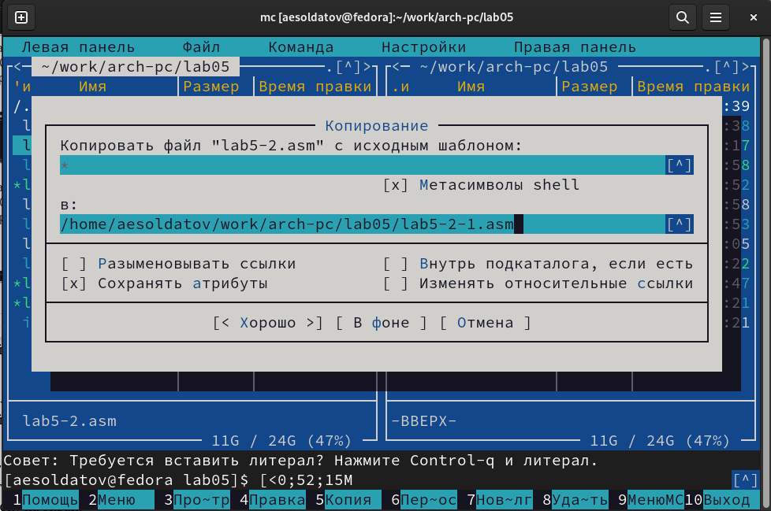{#fig:017 width=70%}

Исправил текст программы с использованием подпрограмм из внешнего файла "in_out.asm", так чтобы она работала по алгоритму, заданному в ТУИС (рис. @fig:018).

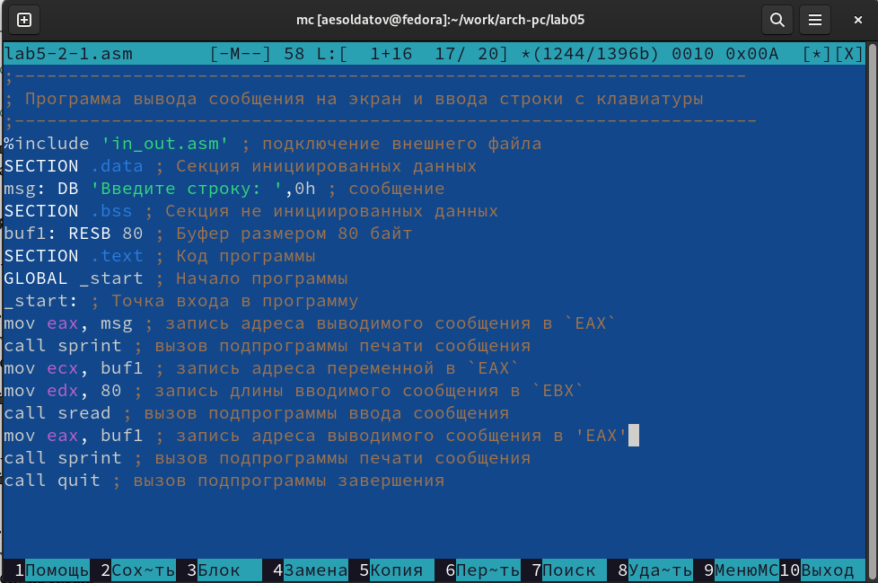{#fig:018 width=70%}

``` NASM
;--------------------------------------------------------------------
; Программа вывода сообщения на экран и ввода строки с клавиатуры
;---------------------------------------------------------------------
%include 'in_out.asm' ; подключение внешнего файла
SECTION .data ; Секция инициированных данных
msg: DB 'Введите строку: ',0h ; сообщение
SECTION .bss ; Секция не инициированных данных
buf1: RESB 80 ; Буфер размером 80 байт
SECTION .text ; Код программы
GLOBAL _start ; Начало программы
_start: ; Точка входа в программу
mov eax, msg ; запись адреса выводимого сообщения в `EAX`
call sprint ; вызов подпрограммы печати сообщения
mov ecx, buf1 ; запись адреса переменной в `EAX`
mov edx, 80 ; запись длины вводимого сообщения в `EBX`
call sread ; вызов подпрограммы ввода сообщения
mov eax, buf1 ; запись адреса выводимого сообщения в 'EAX'
call sprint ; вызов подпрограммы печати сообщения
call quit ; вызов подпрограммы завершения
```

Создал исполняемый файл и проверил его работу (рис. @fig:019).

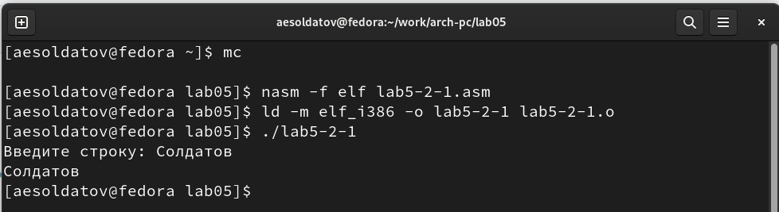{#fig:019 width=70%}

# Выводы

Приобрел практические навыки работы в Midnight Commander и освоил инструкции языка ассемблера mov и int.

# Список литературы{.unnumbered}

::: {#refs}
:::
