---
## Front matter
title: "Лабораторная работа №6"
subtitle: "Арифметические операции в NASM"
author: "Солдатов Алексей"

## Generic otions
lang: ru-RU
toc-title: "Содержание"

## Bibliography
bibliography: bib/cite.bib
csl: pandoc/csl/gost-r-7-0-5-2008-numeric.csl

## Pdf output format
toc: true # Table of contents
toc-depth: 2
lof: true # List of figures
lot: true # List of tables
fontsize: 12pt
linestretch: 1.5
papersize: a4
documentclass: scrreprt
## I18n polyglossia
polyglossia-lang:
  name: russian
  options:
	- spelling=modern
	- babelshorthands=true
polyglossia-otherlangs:
  name: english
## I18n babel
babel-lang: russian
babel-otherlangs: english
## Fonts
mainfont: PT Serif
romanfont: PT Serif
sansfont: PT Sans
monofont: PT Mono
mainfontoptions: Ligatures=TeX
romanfontoptions: Ligatures=TeX
sansfontoptions: Ligatures=TeX,Scale=MatchLowercase
monofontoptions: Scale=MatchLowercase,Scale=0.9
## Biblatex
biblatex: true
biblio-style: "gost-numeric"
biblatexoptions:
  - parentracker=true
  - backend=biber
  - hyperref=auto
  - language=auto
  - autolang=other*
  - citestyle=gost-numeric
## Pandoc-crossref LaTeX customization
figureTitle: "Рис."
tableTitle: "Таблица"
listingTitle: "Листинг"
lofTitle: "Список иллюстраций"
lotTitle: "Список таблиц"
lolTitle: "Листинги"
## Misc options
indent: true
header-includes:
  - \usepackage{indentfirst}
  - \usepackage{float} # keep figures where there are in the text
  - \floatplacement{figure}{H} # keep figures where there are in the text
---

# Цель работы

Освоить арифметические инструкции языка ассемблера NASM.

# Задание

1. Символьные и численные данные в NASM
2. Выполнение арифметических операций в NASM
3. Ответы на вопросы
4. Выполнение заданий для самостоятельной работы

# Теоретическое введение

Здесь описываются теоретические аспекты, связанные с выполнением работы.

Например, в табл. @tbl:std-dir приведено краткое описание стандартных каталогов Unix.

: Описание некоторых каталогов файловой системы GNU Linux {#tbl:std-dir}

| Имя каталога | Описание каталога                                                                                                          |
|--------------|----------------------------------------------------------------------------------------------------------------------------|
| `/`          | Корневая директория, содержащая всю файловую                                                                               |
| `/bin `      | Основные системные утилиты, необходимые как в однопользовательском режиме, так и при обычной работе всем пользователям     |
| `/etc`       | Общесистемные конфигурационные файлы и файлы конфигурации установленных программ                                           |
| `/home`      | Содержит домашние директории пользователей, которые, в свою очередь, содержат персональные настройки и данные пользователя |
| `/media`     | Точки монтирования для сменных носителей                                                                                   |
| `/root`      | Домашняя директория пользователя  `root`                                                                                   |
| `/tmp`       | Временные файлы                                                                                                            |
| `/usr`       | Вторичная иерархия для данных пользователя                                                                                 |

Более подробно об Unix см. в [@gnu-doc:bash;@newham:2005:bash;@zarrelli:2017:bash;@robbins:2013:bash;@tannenbaum:arch-pc:ru;@tannenbaum:modern-os:ru].

# Выполнение лабораторной работы

## Символьные и численные данные в NASM

Создал каталог для программ лабораторной работы №6, перешел в него и создал файл "lab6-1.asm" (рис. @fig;001).

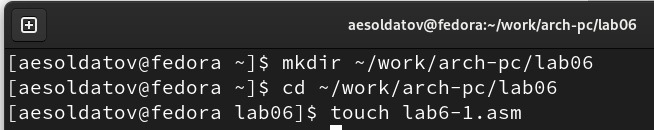{#fig:001 width=70%}

Ввел в файл "lab6-1.asm" текст программы из листинга 6.1. со страницы в ТУИС (рис. @fig:002).

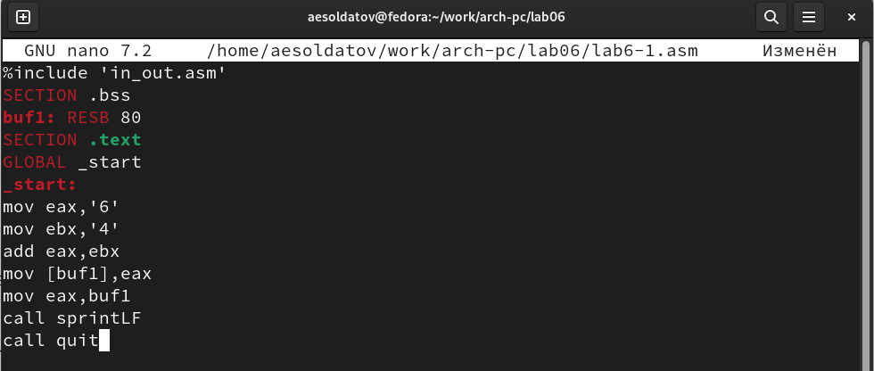{#fig:002 width=70%}

``` NASM
%include 'in_out.asm'
SECTION .bss
buf1: RESB 80
SECTION .text
GLOBAL _start
_start:
mov eax,'6'
mov ebx,'4'
add eax,ebx
mov [buf1],eax
mov eax,buf1
call sprintLF
call quit
```

Перенес файл "in_out.asm" из прошлой папки с лабораторной работой в нынешнюю (рис. @fig:003).

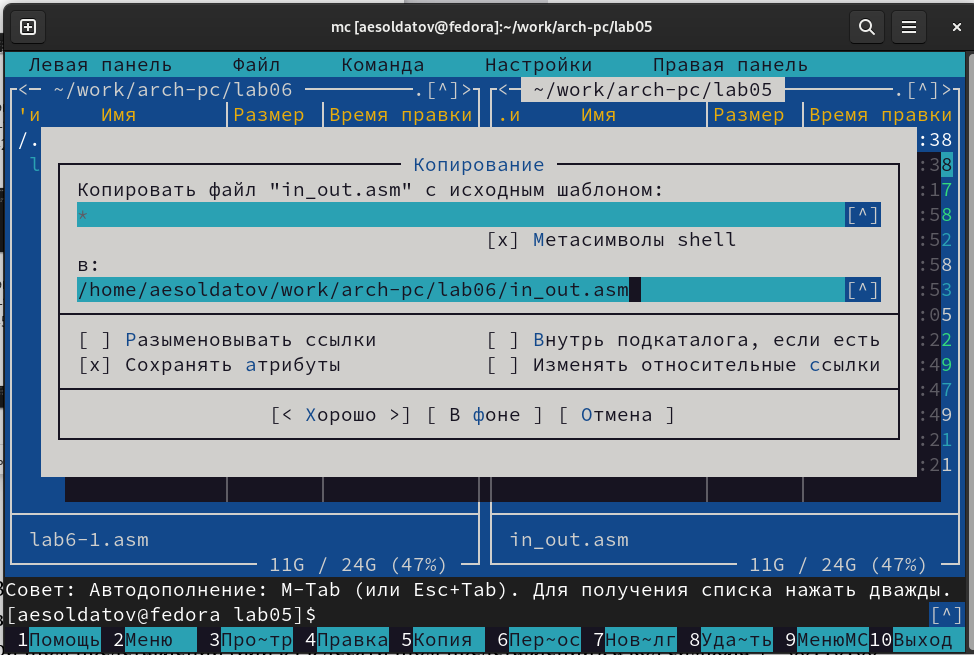{#fig:003 width=70%}

Создал исполняемый файл и запустил его (рис. @fig:004).

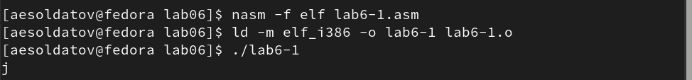{#fig:004 width=70%}

Далее изменил текст программы и вместо символов, записал в регистры числа (рис. @fig:005).

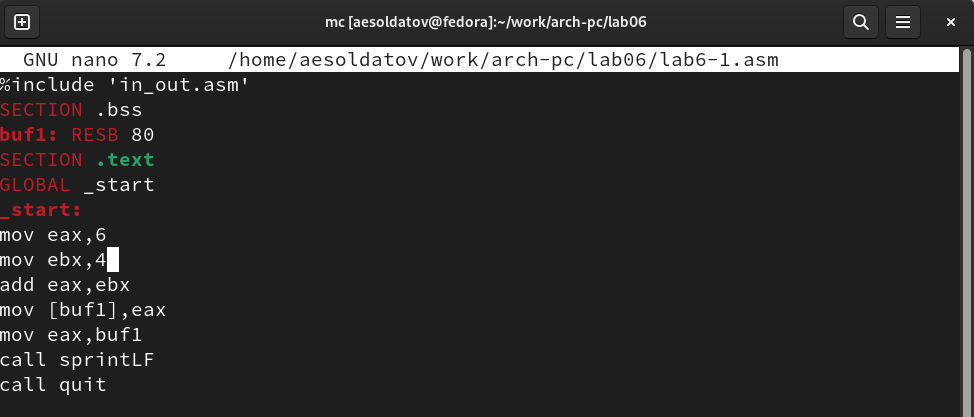{#fig:005 width=70%}

``` NASM
%include 'in_out.asm'
SECTION .bss
buf1: RESB 80
SECTION .text
GLOBAL _start
_start:
mov eax,6
mov ebx,4
add eax,ebx
mov [buf1],eax
mov eax,buf1
call sprintLF
call quit
```

Создал исполняемый файл и запустил его (рис. @fig:006).

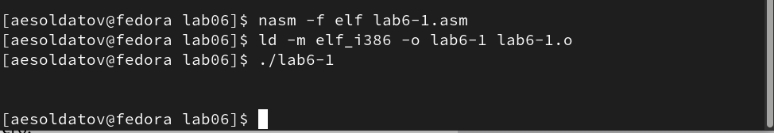{#fig:006 width=70%}

В данном случае выводится символ с кодом 10, этот символ не отображается при выводе на экран.

Создал файл "lab6-2.asm" в каталоге "~/work/arch-pc/lab06" (рис. @fig:007).

{#fig:007 width=70%}

Ввел в него текст программы из листинга 6.2 со страницы в ТУИС  (рис. @fig:008).

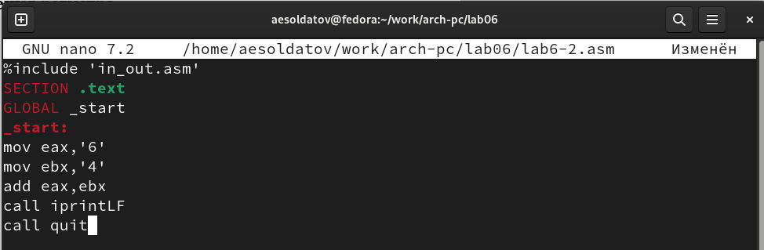{#fig:008 width=70%}

``` NASM
%include 'in_out.asm'
SECTION .text
GLOBAL _start
_start:
mov eax,'6'
mov ebx,'4'
add eax,ebx
call iprintLF
call quit
```

Создал исполняемый файл и запустил его (рис. @fig:009).

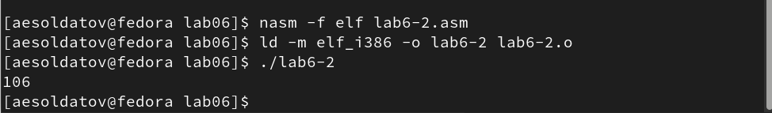{#fig:009 width=70%}

Исправил текст программы и вместо символов, записал в регистры числа (рис. @fig:010).

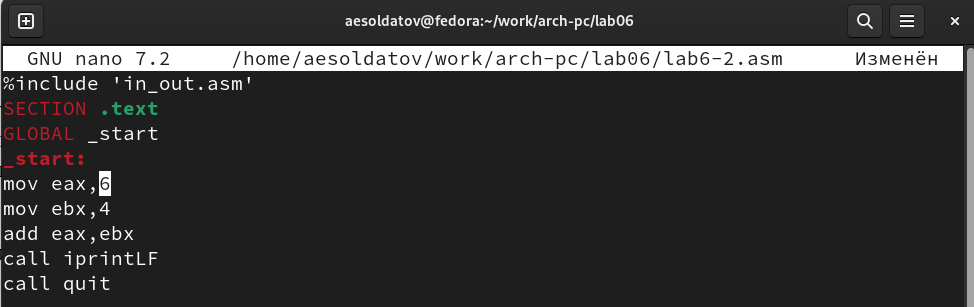{#fig:010 width=70%}

Создал исполняемый файл и проверил его работу (рис. @fig:011).

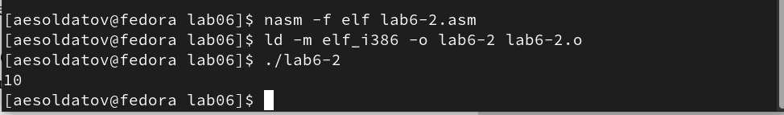{#fig:011 width=70%}

Заменил функцию "iprintLF" на "iprint" (рис. @fig:011-1).

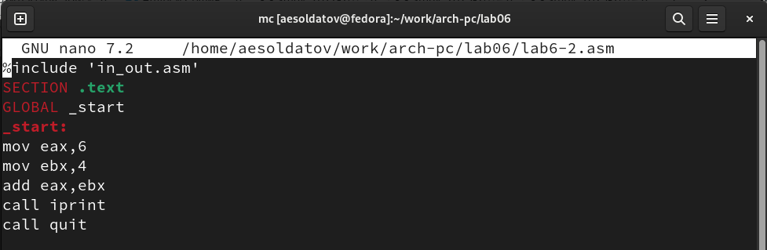{#fig:011-1 width=70%}

Создал исполняемый файл и проверил его работу (рис. @fig:011-2).

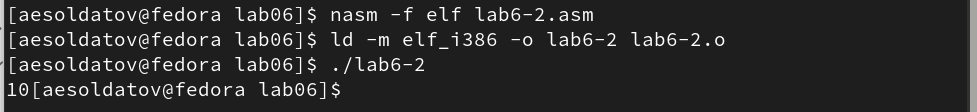{#fig:011-2 width=70%}

Подпрограмма "iprintLF" делает перевод на новую строку, а "iprint" остается на той же.

## Выполнение арифметических операций в NASM

Создал файл "lab6-3.asm" в каталоге "~/work/arch-pc/lab06" (рис. @fig:012).

{#fig:012 width=70%}

Внимательно изучил текст программы из листинга 6.3 со страницы в ТУИС и ввел его в "lab6-3.asm" (рис. @fig:013).

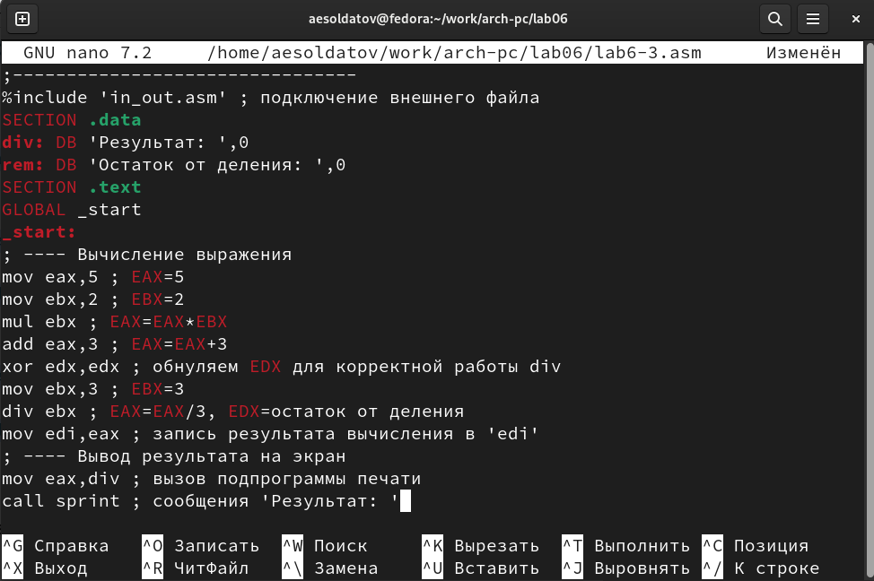{#fig:013 width=70%}

``` NASM
;--------------------------------
; Программа вычисления выражения
;--------------------------------
%include 'in_out.asm' ; подключение внешнего файла
SECTION .data
div: DB 'Результат: ',0
rem: DB 'Остаток от деления: ',0
SECTION .text
GLOBAL _start
_start:
; ---- Вычисление выражения
mov eax,5 ; EAX=5
mov ebx,2 ; EBX=2
mul ebx ; EAX=EAX*EBX
add eax,3 ; EAX=EAX+3
xor edx,edx ; обнуляем EDX для корректной работы div
mov ebx,3 ; EBX=3
div ebx ; EAX=EAX/3, EDX=остаток от деления
mov edi,eax ; запись результата вычисления в 'edi'
; ---- Вывод результата на экран
mov eax,div ; вызов подпрограммы печати
call sprint ; сообщения 'Результат: '
mov eax,edi ; вызов подпрограммы печати значения
call iprintLF ; из 'edi' в виде символов
mov eax,rem ; вызов подпрограммы печати
call sprint ; сообщения 'Остаток от деления: '
mov eax,edx ; вызов подпрограммы печати значения
call iprintLF ; из 'edx' (остаток) в виде символов
call quit ; вызов подпрограммы завершения
```

Создал исполняемый файл и проверил его работу, результат совпал с примером из лабораторной (рис. @fig:014).

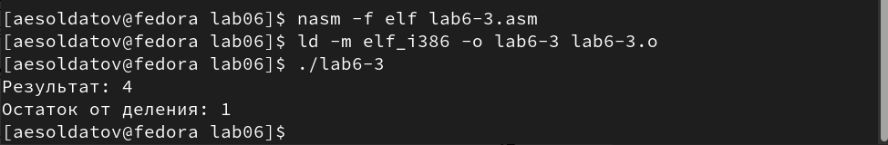{#fig:014 width=70%}

Изменил текст программы для вычисления выражения f(x) = (4 * 6 + 2)/5 (рис. @fig:015).

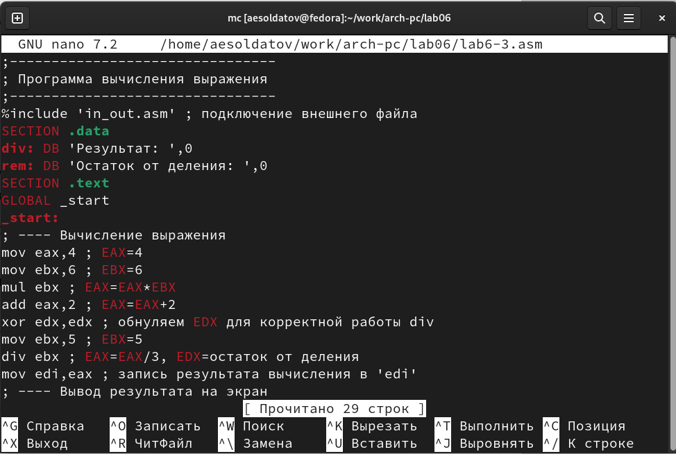{#fig:015 width=70%}

``` NASM
;--------------------------------
; Программа вычисления выражения
;--------------------------------
%include 'in_out.asm' ; подключение внешнего файла
SECTION .data
div: DB 'Результат: ',0
rem: DB 'Остаток от деления: ',0
SECTION .text
GLOBAL _start
_start:
; ---- Вычисление выражения
mov eax,4 ; EAX=4
mov ebx,6 ; EBX=6
mul ebx ; EAX=EAX*EBX
add eax,2 ; EAX=EAX+2
xor edx,edx ; обнуляем EDX для корректной работы div
mov ebx,5 ; EBX=5
div ebx ; EAX=EAX/3, EDX=остаток от деления
mov edi,eax ; запись результата вычисления в 'edi'
; ---- Вывод результата на экран
mov eax,div ; вызов подпрограммы печати
call sprint ; сообщения 'Результат: '
mov eax,edi ; вызов подпрограммы печати значения
call iprintLF ; из 'edi' в виде символов
mov eax,rem ; вызов подпрограммы печати
call sprint ; сообщения 'Остаток от деления: '
mov eax,edx ; вызов подпрограммы печати значения
call iprintLF ; из 'edx' (остаток) в виде символов
call quit ; вызов подпрограммы завершения
```

Создал исполняемый файл и проверил его работу (рис. @fig:016).

{#fig:016 width=70%}

Создал файл "variant.asm" в каталоге "~/work/arch-pc/lab06" (рис. @fig:017).

{#fig:017 width=70%}

Внимательно изучил текст программы из листинга 6.4 на странице в ТУИС и ввел его в файл variant.asm (рис. @fig:018).

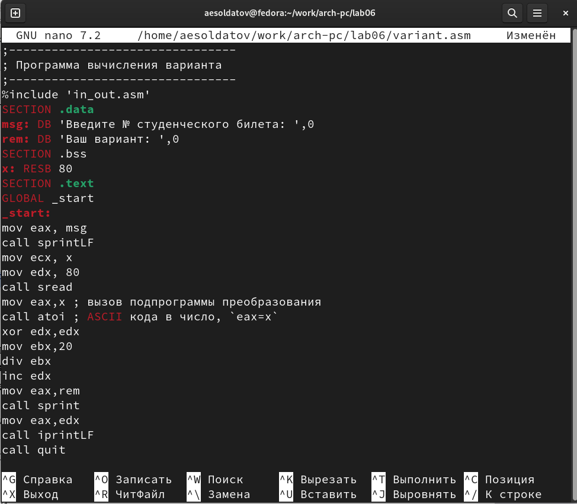{#fig:018 width=70%}

``` NASM
;--------------------------------
; Программа вычисления варианта
;--------------------------------
%include 'in_out.asm'
SECTION .data
msg: DB 'Введите № студенческого билета: ',0
rem: DB 'Ваш вариант: ',0
SECTION .bss
x: RESB 80
SECTION .text
GLOBAL _start
_start:
mov eax, msg
call sprintLF
mov ecx, x
mov edx, 80
call sread
mov eax,x ; вызов подпрограммы преобразования
call atoi ; ASCII кода в число, `eax=x`
xor edx,edx
mov ebx,20
div ebx
inc edx
mov eax,rem
call sprint
mov eax,edx
call iprintLF
call quit
```

Создал исполняемый файл и проверил его работу, программа выдала, что мой номер 10 (Ответ совпадает с аналитическим решением) (рис. @fig:019).

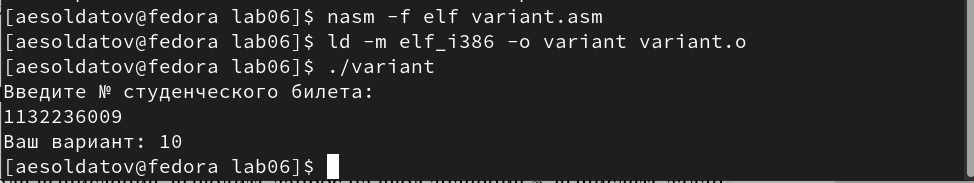{#fig:019 width=70%}

## Ответы на вопросы

1. За вывод сообщения "Ваш вариант" отвечают строчки кода

``` NASM
mov eax,rem
call sprint
```

2. Инструкция "mov, есx, х" используется, чтобы положить адрес вводимой строки "х" в регистр "есх". 
"mov edx, 80" - запись в регистр "edx" длины вводимой строки.
"call sread" - вызов подпрограммы из внешнего файла, обеспечивающей ввод сообщения с клавиатуры.

3. "call atoi" используется для вызова подпрограммы из внешнего файла, которая преобразует ascii-код символа в целое число и записывает результат в регистр "eax".

4. За вычисления варианта отвечают строки:

``` NASM
хот edx, edx ; обнуление еах для корректной работы div
mov ebx, 20 ; ebx = 20
div ebx ; eax = eax/20, edx - остаток от деления
inc edx ; edx = edx + 1
```

5. При выполнении инструкции "div ebx" остаток от деления записывается в регистр "edx".

6. Инструкция "inc edx" увеличивает значение регистра "edx" на 1.

7. За вывод на экран результатов вычислений отвечают строки:

``` NASM
mov eax, edx
call iprintLF
```

## Выполнение заданий для самостоятельной работы

Создаю файл "samrab.asm" (рис. @fig:019-1).

{#fig:019-1 width=70%}

Пишу в нем программу по варианту, вычисленному из предыдущей программы (рис. @fig:020).

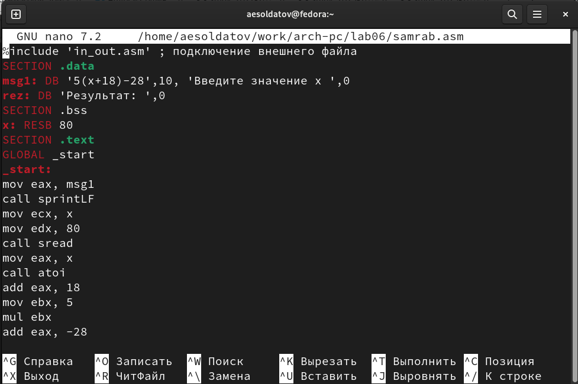{#fig:020 width=70%}

``` NASM
%include 'in_out.asm' ; подключение внешнего файла
SECTION .data
msg1: DB '5(x+18)-28',10, 'Введите значение x ',0
rez: DB 'Результат: ',0
SECTION .bss
x: RESB 80
SECTION .text
GLOBAL _start
_start:
mov eax, msg1
call sprintLF
mov ecx, x
mov edx, 80
call sread
mov eax, x
call atoi
add eax, 18
mov ebx, 5
mul ebx
add eax, -28
mov edi, eax
mov eax, rez
call sprint
mov eax, edi
call iprintLF
call quit
```

Создаю исполняемый файл и запускаю программу (рис. @fig:021).

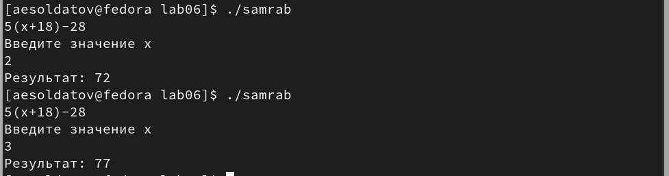{#fig:021 width=70%}

Программа выдает правильный ответ.

# Выводы

Освоил арифметические инструкции языка ассемблера NASM.

# Список литературы{.unnumbered}

::: {#refs}
:::
