---
## Front matter
title: "Лабораторная работа №7"
subtitle: "Команды безусловного и условного переходов в Nasm. Программирование ветвлений."
author: "Солдатов Алексей"

## Generic otions
lang: ru-RU
toc-title: "Содержание"

## Bibliography
bibliography: bib/cite.bib
csl: pandoc/csl/gost-r-7-0-5-2008-numeric.csl

## Pdf output format
toc: true # Table of contents
toc-depth: 2
lof: true # List of figures
lot: true # List of tables
fontsize: 12pt
linestretch: 1.5
papersize: a4
documentclass: scrreprt
## I18n polyglossia
polyglossia-lang:
  name: russian
  options:
	- spelling=modern
	- babelshorthands=true
polyglossia-otherlangs:
  name: english
## I18n babel
babel-lang: russian
babel-otherlangs: english
## Fonts
mainfont: PT Serif
romanfont: PT Serif
sansfont: PT Sans
monofont: PT Mono
mainfontoptions: Ligatures=TeX
romanfontoptions: Ligatures=TeX
sansfontoptions: Ligatures=TeX,Scale=MatchLowercase
monofontoptions: Scale=MatchLowercase,Scale=0.9
## Biblatex
biblatex: true
biblio-style: "gost-numeric"
biblatexoptions:
  - parentracker=true
  - backend=biber
  - hyperref=auto
  - language=auto
  - autolang=other*
  - citestyle=gost-numeric
## Pandoc-crossref LaTeX customization
figureTitle: "Рис."
tableTitle: "Таблица"
listingTitle: "Листинг"
lofTitle: "Список иллюстраций"
lotTitle: "Список таблиц"
lolTitle: "Листинги"
## Misc options
indent: true
header-includes:
  - \usepackage{indentfirst}
  - \usepackage{float} # keep figures where there are in the text
  - \floatplacement{figure}{H} # keep figures where there are in the text
---

# Цель работы

Изучить команды условного и безусловного переходов. Приобрести навыки написания программ с использованием переходов. Познакомиться с назначением и структурой файла листинга.

# Задание

1. Реализация переходов в NASM
2. Изучение структуры листинга
3. Выполнение заданий для самостоятельной работs

# Теоретическое введение

Здесь описываются теоретические аспекты, связанные с выполнением работы.

Например, в табл. @tbl:std-dir приведено краткое описание стандартных каталогов Unix.

: Описание некоторых каталогов файловой системы GNU Linux {#tbl:std-dir}

| Имя каталога | Описание каталога                                                                                                          |
|--------------|----------------------------------------------------------------------------------------------------------------------------|
| `/`          | Корневая директория, содержащая всю файловую                                                                               |
| `/bin `      | Основные системные утилиты, необходимые как в однопользовательском режиме, так и при обычной работе всем пользователям     |
| `/etc`       | Общесистемные конфигурационные файлы и файлы конфигурации установленных программ                                           |
| `/home`      | Содержит домашние директории пользователей, которые, в свою очередь, содержат персональные настройки и данные пользователя |
| `/media`     | Точки монтирования для сменных носителей                                                                                   |
| `/root`      | Домашняя директория пользователя  `root`                                                                                   |
| `/tmp`       | Временные файлы                                                                                                            |
| `/usr`       | Вторичная иерархия для данных пользователя                                                                                 |

Более подробно об Unix см. в [@gnu-doc:bash;@newham:2005:bash;@zarrelli:2017:bash;@robbins:2013:bash;@tannenbaum:arch-pc:ru;@tannenbaum:modern-os:ru].

# Выполнение лабораторной работы

## Реализация переходов в NASM

Создал каталог для программ лабораторной работы №7, перешел в него и создал файл "lab7-1.asm" (рис. @fig:001).

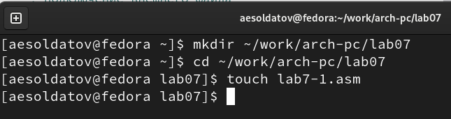{#fig:001 width=70%}

Ввел в файл "lab7-1.asm" текст программы из листинга 7.1. со страницы в ТУИС (рис. @fig:002).

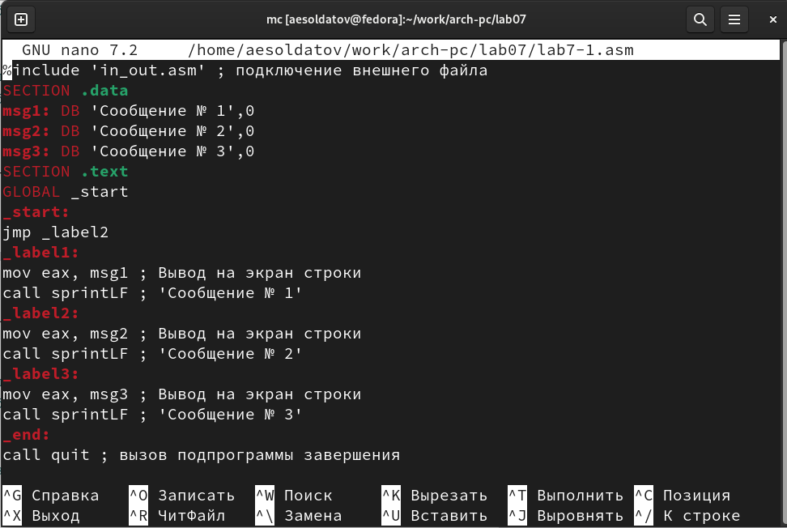{#fig:002 width=70%}

``` NASM
%include 'in_out.asm' ; подключение внешнего файла
SECTION .data
msg1: DB 'Сообщение № 1',0
msg2: DB 'Сообщение № 2',0
msg3: DB 'Сообщение № 3',0
SECTION .text
GLOBAL _start
_start:
jmp _label2
_label1:
mov eax, msg1 ; Вывод на экран строки
call sprintLF ; 'Сообщение № 1'
_label2:
mov eax, msg2 ; Вывод на экран строки
call sprintLF ; 'Сообщение № 2'
_label3:
mov eax, msg3 ; Вывод на экран строки
call sprintLF ; 'Сообщение № 3'
_end:
call quit ; вызов подпрограммы завершения
```

Перенес файл "in_out.asm" из прошлой папки с лабораторной работой в нынешнюю (рис. @fig:003).

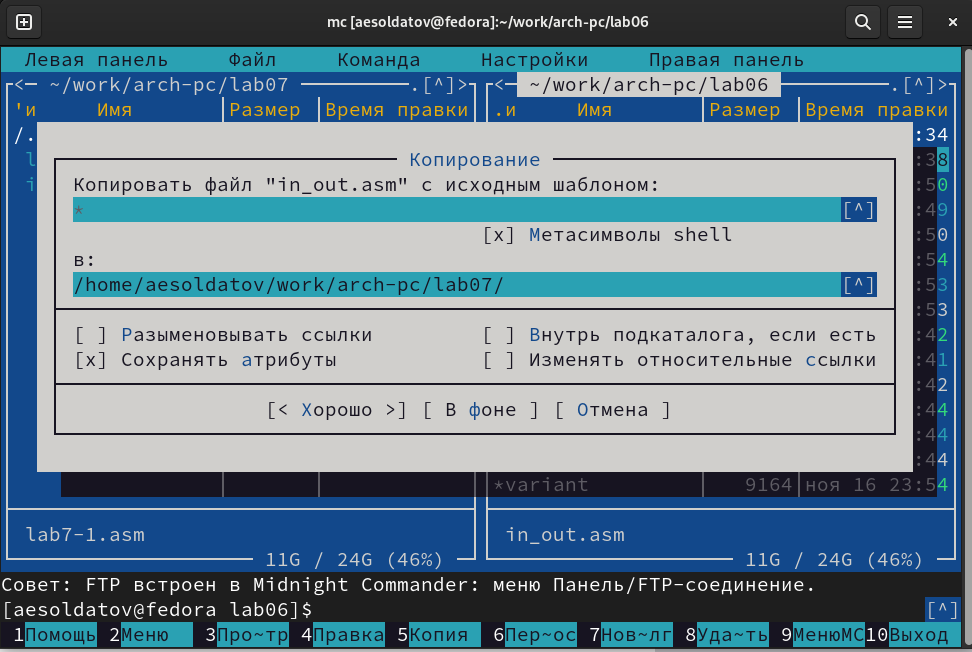{#fig:003 width=70%}

Создал исполняемый файл и запустил его. Он совпадает с примером (рис. @fig:004).

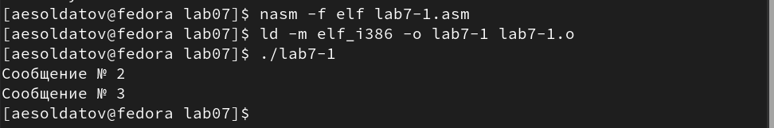{#fig:004 width=70%}

Далее изменил текст программы в соответствии с листингом 7.2 (рис. @fig:005).

{#fig:005 width=70%}

``` NASM
%include 'in_out.asm' ; подключение внешнего файла
SECTION .data
msg1: DB 'Сообщение № 1',0
msg2: DB 'Сообщение № 2',0
msg3: DB 'Сообщение № 3',0
SECTION .text
GLOBAL _start
_start:
jmp _label2
_label1:
mov eax, msg1 ; Вывод на экран строки
call sprintLF ; 'Сообщение № 1'
jmp _end
_label2:
mov eax, msg2 ; Вывод на экран строки
call sprintLF ; 'Сообщение № 2'
jmp _label1
_label3:
mov eax, msg3 ; Вывод на экран строки
call sprintLF ; 'Сообщение № 3'
_end:
call quit ; вызов подпрограммы завершения
```

Создал исполняемый файл и запустил его, программа работает правильно (рис. @fig:006).

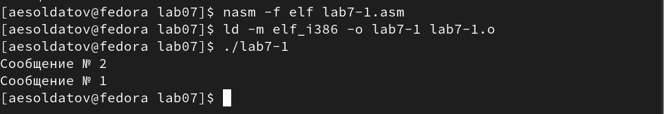{#fig:006 width=70%}

Изменил текст программы, чтобы вывод программы соответствовал примеру (рис. @fig:007).

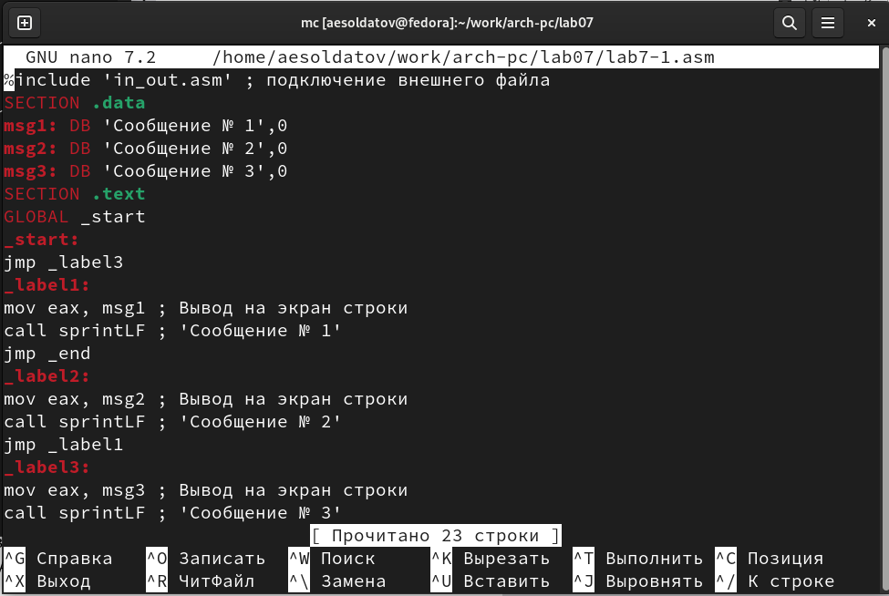{#fig:007 width=70%}

``` NASM
%include 'in_out.asm' ; подключение внешнего файла
SECTION .data
msg1: DB 'Сообщение № 1',0
msg2: DB 'Сообщение № 2',0
msg3: DB 'Сообщение № 3',0
SECTION .text
GLOBAL _start
_start:
jmp _label3
_label1:
mov eax, msg1 ; Вывод на экран строки
call sprintLF ; 'Сообщение № 1'
jmp _end
_label2:
mov eax, msg2 ; Вывод на экран строки
call sprintLF ; 'Сообщение № 2'
jmp _label1
_label3:
mov eax, msg3 ; Вывод на экран строки
call sprintLF ; 'Сообщение № 3'
jmp _label2
_end:
call quit ; вызов подпрограммы завершения

```

Создал исполняемый файл и запустил его, вывод соответствует примеру (рис. @fig:008).

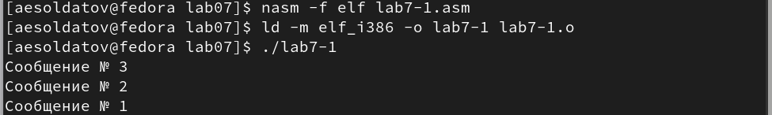{#fig:008 width=70%}

Создал файл "lab7-2.asm" в каталоге "~/work/arch-pc/lab07" (рис. @fig:009).

{#fig:009 width=70%}

Внимательно изучил текст программы из листинга 7.3 и ввел его в файл (рис. @fig:010).

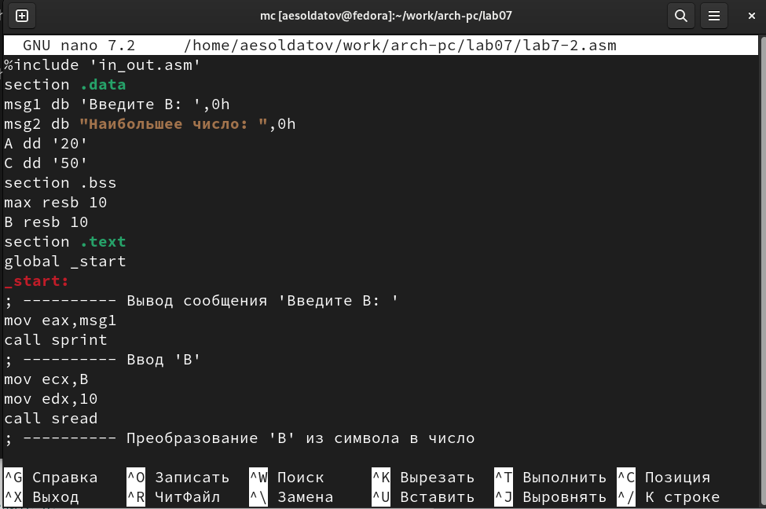{#fig:010 width=70%}

``` NASM
%include 'in_out.asm'
section .data
msg1 db 'Введите B: ',0h
msg2 db "Наибольшее число: ",0h
A dd '20'
C dd '50'
section .bss
max resb 10
B resb 10
section .text
global _start
_start:
; ---------- Вывод сообщения 'Введите B: '
mov eax,msg1
call sprint
; ---------- Ввод 'B'
mov ecx,B
mov edx,10
call sread
; ---------- Преобразование 'B' из символа в число
mov eax,B
call atoi ; Вызов подпрограммы перевода символа в число
mov [B],eax ; запись преобразованного числа в 'B'
; ---------- Записываем 'A' в переменную 'max'
mov ecx,[A] ; 'ecx = A'
mov [max],ecx ; 'max = A'
; ---------- Сравниваем 'A' и 'С' (как символы)
cmp ecx,[C] ; Сравниваем 'A' и 'С'
jg check_B ; если 'A>C', то переход на метку 'check_B',
mov ecx,[C] ; иначе 'ecx = C'
mov [max],ecx ; 'max = C'
; ---------- Преобразование 'max(A,C)' из символа в число
check_B:
mov eax,max
call atoi ; Вызов подпрограммы перевода символа в число
mov [max],eax ; запись преобразованного числа в `max`
; ---------- Сравниваем 'max(A,C)' и 'B' (как числа)
mov ecx,[max]
cmp ecx,[B] ; Сравниваем 'max(A,C)' и 'B'
jg fin ; если 'max(A,C)>B', то переход на 'fin',
mov ecx,[B] ; иначе 'ecx = B'
mov [max],ecx
; ---------- Вывод результата
fin:
mov eax, msg2
call sprint ; Вывод сообщения 'Наибольшее число: '
mov eax,[max]
call iprintLF ; Вывод 'max(A,B,C)'
call quit ; Выход
```

Создал исполняемый файл и проверил его работу для разных значений (рис. @fig:011).

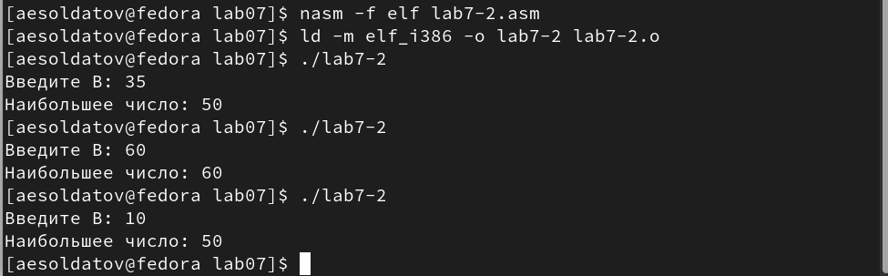{#fig:011 width=70%}

## Изучение структуры листинга

Создал файл листинга для файла "lab7-2.asm" с помощью ключа "-l" и открыл его (рис. @fig:012).

{#fig:012 width=70%}

Внимательно изучил его формат и содержимое (рис. @fig:013).

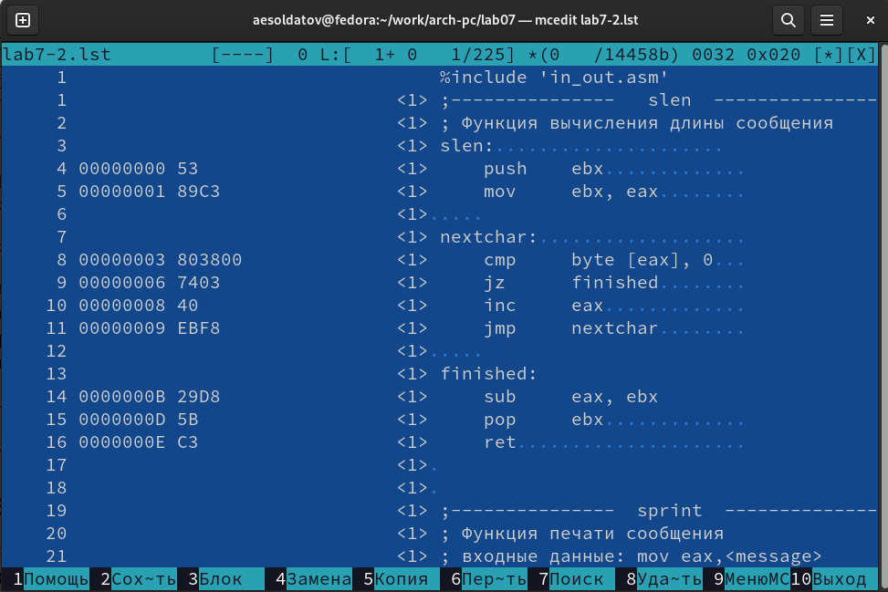{#fig:013 width=70%}

Строки в файле листинга имеют следующую структуру. Первое число обозначает номер строки файла листинга (может не соответствовать номеру строки в файле с исходным кодом). Далее идет адрес (указывает на смещение машинного кода от начала текущего сегмента). Потом идет сам машинный код, он представляет собой ассемблированную исходную строку в виде шестнадцатеричной последовательности. А в конце пишется исходный текст программы, которая является исходной строкой программы вместе с комментариями.

Первая строка, которую я буду описывать имеет номер 38. Далее идет ее адрес (0000013А), который дает нам информацию о смещении машинного кода. Следом идет сам машинный код который является ассемблированием инструкции "mov ecx,max" в шестнадцатеричный код. В конце мы видим как выглядит строка в самой программе (рис. @fig:013-1).

{#fig:013-1 width=70%}

Вторая строка, которую я буду описывать имеет номер 29. Далее идет ее адрес (0000011D), который дает нам информацию о смещении машинного кода. Следом идет сам машинный код который является ассемблированием инструкции "jg check_B" в шестнадцатеричный код. В конце мы видим как выглядит строка в самой программе (рис. @fig:013-2).

{#fig:013-2 width=70%}

Третья строка, которую я буду описывать имеет номер 35. Далее идет ее адрес (00000130), который дает нам информацию о смещении машинного кода. Следом идет сам машинный код который является ассемблированием инструкции "call atoi" в шестнадцатеричный код. В конце мы видим как выглядит строка в самой программе (рис. @fig:013-3).

{#fig:013-3 width=70%}

Открыл файл с программой "lab7-2.asm" и в инструкции с двумя операндами удалил один операнд, выполнил трансляцию листинга и получил ошибку с указанием номера строки (рис. @fig:014).

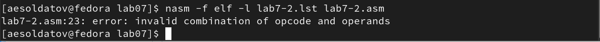{#fig:014 width=70%}

После этого на месте ошибки в файле листинга появился комментарий с типом ошибки (рис. @fig:015).

{#fig:015 width=70%}

## Выполнение заданий для самостоятельной работы

### Задание 1

Создал файл "samrab1.asm" (рис. @fig:016).

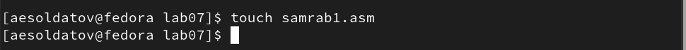{#fig:016 width=70%}

Написал программу нахождения наименьшей из трех целочисленных переменных (рис. @fig:017).

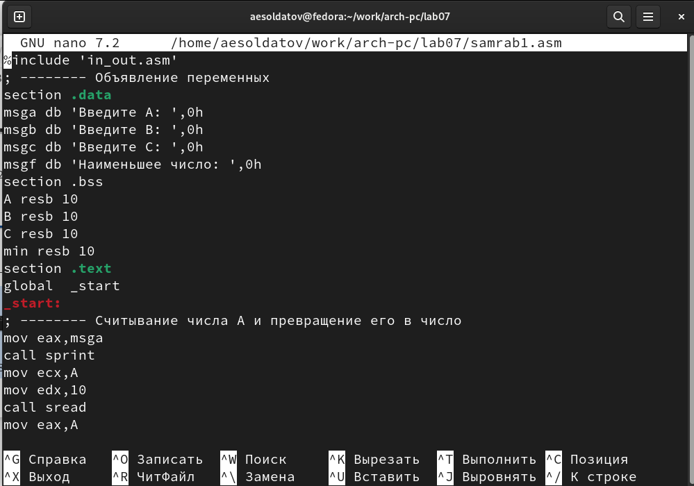{#fig:017 width=70%}

``` NASM
%include 'in_out.asm'
; -------- Объявление переменных
section .data
msga db 'Введите A: ',0h
msgb db 'Введите B: ',0h
msgc db 'Введите C: ',0h
msgf db 'Наименьшее число: ',0h
section .bss
A resb 10
B resb 10
C resb 10
min resb 10
section .text
global  _start
_start:
; -------- Считывание числа А и превращение его в число
mov eax,msga
call sprint
mov ecx,A
mov edx,10
call sread
mov eax,A
call atoi
mov [A],eax
; -------- Считывание числа В и превращение его в число
mov eax,msgb
call sprint
mov ecx,B
mov edx,10
call sread
mov eax,B
call atoi
mov [B],eax
; -------- Считывание числа C и превращение его в число
mov eax,msgc
call sprint
mov ecx,C
mov edx,10
call sread
mov eax,C
call atoi
mov [C],eax
; -------- Нахождение максимума
mov ecx,[A]
mov [min],ecx
cmp ecx,[C]
jl check_B
mov ecx,[C]
mov [min],ecx

check_B:
cmp ecx,[B]
jl fin
mov ecx,[B]
mov [min],ecx

fin:
mov eax, msgf
call sprint
mov eax,[min]
call iprintLF
call quit
```

Создал исполняемый файл и ввел значения переменных из таблицы 7.5 в соответствии с вариантом из прошлой работы (рис. @fig:018).

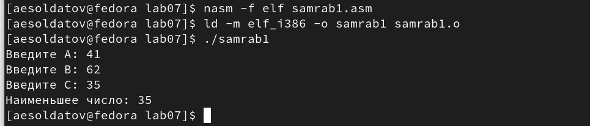{#fig:018 width=70%}

### Задание 2

Создал файл "samrab2.asm" (рис. @fig:019).

{#fig:019 width=70%}

Написал программу для вычисления значения функции (вид функции взял из таблицы 7.6 в соответствии с вариантом из прошлой работы) (рис. @fig:020).

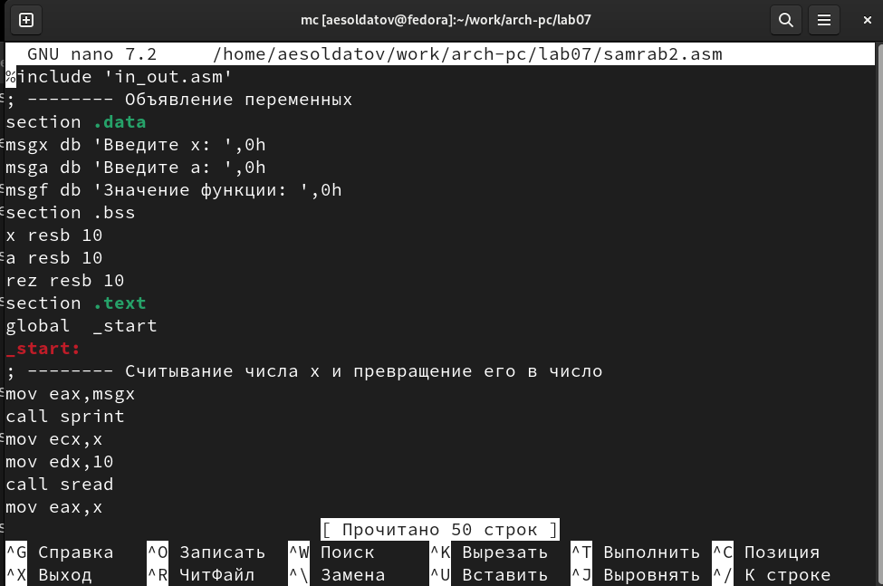{#fig:020 width=70%}

``` NASM
%include 'in_out.asm'
; -------- Объявление переменных
section .data
msgx db 'Введите x: ',0h
msga db 'Введите a: ',0h
msgf db 'Значение функции: ',0h
section .bss
x resb 10
a resb 10
rez resb 10
section .text
global  _start
_start:
; -------- Считывание числа x и превращение его в число
mov eax,msgx
call sprint
mov ecx,x
mov edx,10
call sread
mov eax,x
call atoi
mov [x],eax
; -------- Считывание числа a и превращение его в число
mov eax,msga
call sprint
mov ecx,a
mov edx,10
call sread
mov eax,a
call atoi
mov [a],eax
; -------- Расчет значения функции
mov eax,[x]
cmp eax,2
ja _else
mov eax,[a]
mov ebx,3
mul ebx
mov [rez],eax

_else:
add eax,-2
mov [rez],eax

fin:
mov eax, msgf
call sprint
mov eax,[rez]
call iprintLF
call quit
```

Создал исполняемый файл и ввел значения переменных из таблицы 7.6 в соответствии с вариантом из прошлой работы (рис. @fig:021).

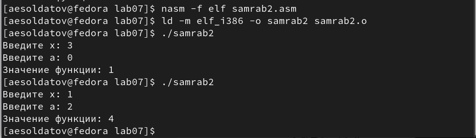{#fig:021 width=70%}

# Выводы

Изучил команды условного и безусловного переходов. Приобрел навыки написания программ с использованием переходов. Познакомился с назначением и структурой файла листинга.

# Список литературы{.unnumbered}

::: {#refs}
:::
