---
## Front matter
title: "Лабораторная работа №8"
subtitle: "Программирование цикла. Обработка аргументов командной строки."
author: "Солдатов Алексей"

## Generic otions
lang: ru-RU
toc-title: "Содержание"

## Bibliography
bibliography: bib/cite.bib
csl: pandoc/csl/gost-r-7-0-5-2008-numeric.csl

## Pdf output format
toc: true # Table of contents
toc-depth: 2
lof: true # List of figures
lot: true # List of tables
fontsize: 12pt
linestretch: 1.5
papersize: a4
documentclass: scrreprt
## I18n polyglossia
polyglossia-lang:
  name: russian
  options:
	- spelling=modern
	- babelshorthands=true
polyglossia-otherlangs:
  name: english
## I18n babel
babel-lang: russian
babel-otherlangs: english
## Fonts
mainfont: PT Serif
romanfont: PT Serif
sansfont: PT Sans
monofont: PT Mono
mainfontoptions: Ligatures=TeX
romanfontoptions: Ligatures=TeX
sansfontoptions: Ligatures=TeX,Scale=MatchLowercase
monofontoptions: Scale=MatchLowercase,Scale=0.9
## Biblatex
biblatex: true
biblio-style: "gost-numeric"
biblatexoptions:
  - parentracker=true
  - backend=biber
  - hyperref=auto
  - language=auto
  - autolang=other*
  - citestyle=gost-numeric
## Pandoc-crossref LaTeX customization
figureTitle: "Рис."
tableTitle: "Таблица"
listingTitle: "Листинг"
lofTitle: "Список иллюстраций"
lotTitle: "Список таблиц"
lolTitle: "Листинги"
## Misc options
indent: true
header-includes:
  - \usepackage{indentfirst}
  - \usepackage{float} # keep figures where there are in the text
  - \floatplacement{figure}{H} # keep figures where there are in the text
---

# Цель работы

Приобрести навыки написания программ с использованием циклов и обработкой аргументов командной строки.

# Задание

1. Реализация циклов в NASM
2. Обработка аргументов командной строки
3. Выполнение заданий для самостоятельной работы

# Теоретическое введение

Здесь описываются теоретические аспекты, связанные с выполнением работы.

Например, в табл. @tbl:std-dir приведено краткое описание стандартных каталогов Unix.

: Описание некоторых каталогов файловой системы GNU Linux {#tbl:std-dir}

| Имя каталога | Описание каталога                                                                                                          |
|--------------|----------------------------------------------------------------------------------------------------------------------------|
| `/`          | Корневая директория, содержащая всю файловую                                                                               |
| `/bin `      | Основные системные утилиты, необходимые как в однопользовательском режиме, так и при обычной работе всем пользователям     |
| `/etc`       | Общесистемные конфигурационные файлы и файлы конфигурации установленных программ                                           |
| `/home`      | Содержит домашние директории пользователей, которые, в свою очередь, содержат персональные настройки и данные пользователя |
| `/media`     | Точки монтирования для сменных носителей                                                                                   |
| `/root`      | Домашняя директория пользователя  `root`                                                                                   |
| `/tmp`       | Временные файлы                                                                                                            |
| `/usr`       | Вторичная иерархия для данных пользователя                                                                                 |

Более подробно об Unix см. в [@gnu-doc:bash;@newham:2005:bash;@zarrelli:2017:bash;@robbins:2013:bash;@tannenbaum:arch-pc:ru;@tannenbaum:modern-os:ru].

# Выполнение лабораторной работы

## Реализация циклов в NASM

Создал каталог для программ лабораторной работы №8, перешел в него и создал файл "lab8-1.asm" (рис. @fig:001).

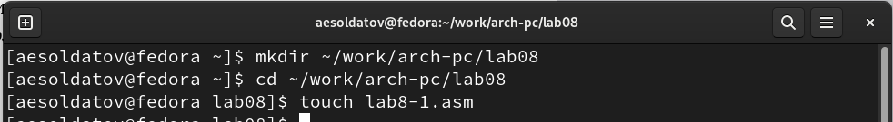{#fig:001 width=70%}

Внимательно изучил текст программы из листинга 8.1 со страницы в ТУИС и ввел в файл "lab8-1.asm" текст программы (рис. @fig:002).

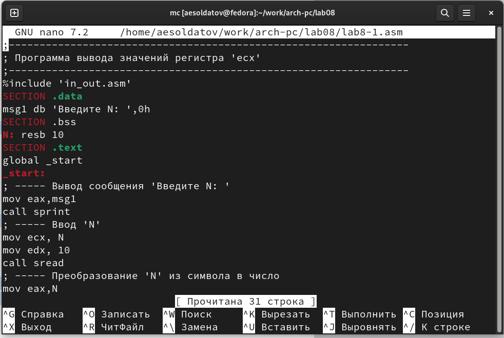{#fig:002 width=70%}

``` NASM
;-----------------------------------------------------------------
; Программа вывода значений регистра 'ecx'
;-----------------------------------------------------------------
%include 'in_out.asm'
SECTION .data
msg1 db 'Введите N: ',0h
SECTION .bss
N: resb 10
SECTION .text
global _start
_start:
; ----- Вывод сообщения 'Введите N: '
mov eax,msg1
call sprint
; ----- Ввод 'N'
mov ecx, N
mov edx, 10
call sread
; ----- Преобразование 'N' из символа в число
mov eax,N
call atoi
mov [N],eax
; ------ Организация цикла
mov ecx,[N] ; Счетчик цикла, `ecx=N`
label:
mov [N],ecx
mov eax,[N]
call iprintLF ; Вывод значения `N`
loop label ; `ecx=ecx-1` и если `ecx` не '0'
; переход на `label`
call quit
```

Перенес файл "in_out.asm" из прошлой папки с лабораторной работой в нынешнюю (рис. @fig:003).

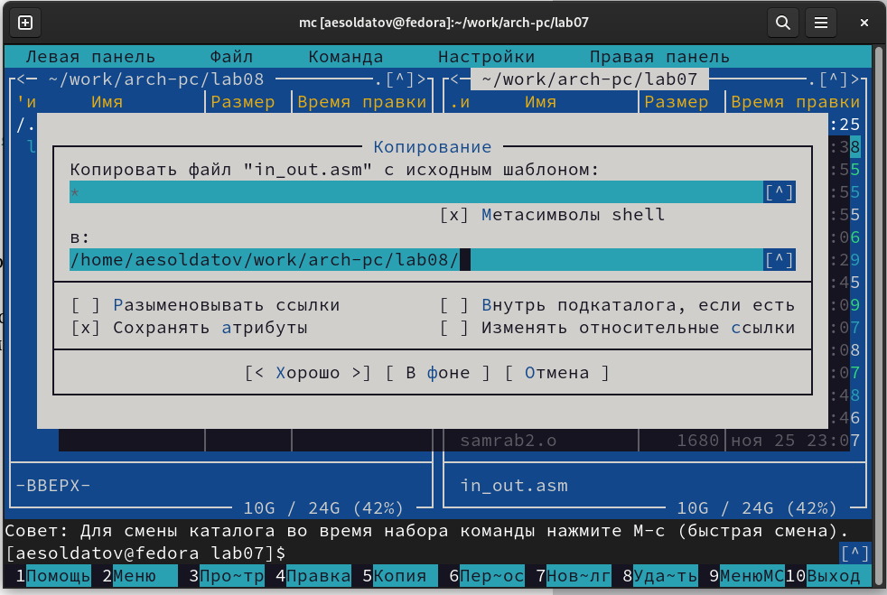{#fig:003 width=70%}

Создал исполняемый файл и запустил его (рис. @fig:004).

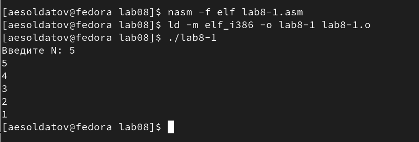{#fig:004 width=70%}

Далее изменил текст программы добавив изменение значение регистра "ecx" в цикле (рис. @fig:005).

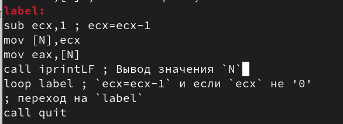{#fig:005 width=70%}

``` NASM
;-----------------------------------------------------------------
; Программа вывода значений регистра 'ecx'
;-----------------------------------------------------------------
%include 'in_out.asm'
SECTION .data
msg1 db 'Введите N: ',0h
SECTION .bss
N: resb 10
SECTION .text
global _start
_start:
; ----- Вывод сообщения 'Введите N: '
mov eax,msg1
call sprint
; ----- Ввод 'N'
mov ecx, N
mov edx, 10
call sread
; ----- Преобразование 'N' из символа в число
mov eax,N
call atoi
mov [N],eax
; ------ Организация цикла
mov ecx,[N] ; Счетчик цикла, `ecx=N`
label:
sub ecx,1 ; ecx=ecx-1
mov [N],ecx
mov eax,[N]
call iprintLF ; Вывод значения `N`
loop label ; `ecx=ecx-1` и если `ecx` не '0'
; переход на `label`
call quit
```

Создал исполняемый файл и запустил его, программа работает неправильно (рис. @fig:006).

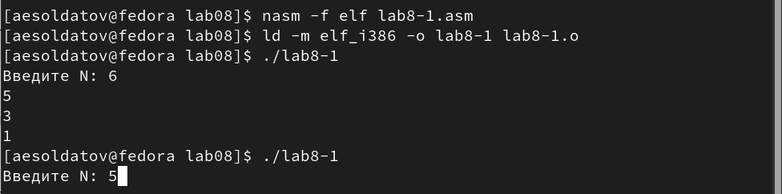{#fig:006 width=70%}

При четном значении N программа выводит значение через один, а при нечетном цикл стал бесконечно выводить непонятные значения, из-за изменения регистра "ecx" в программе (рис. @fig:006-1).

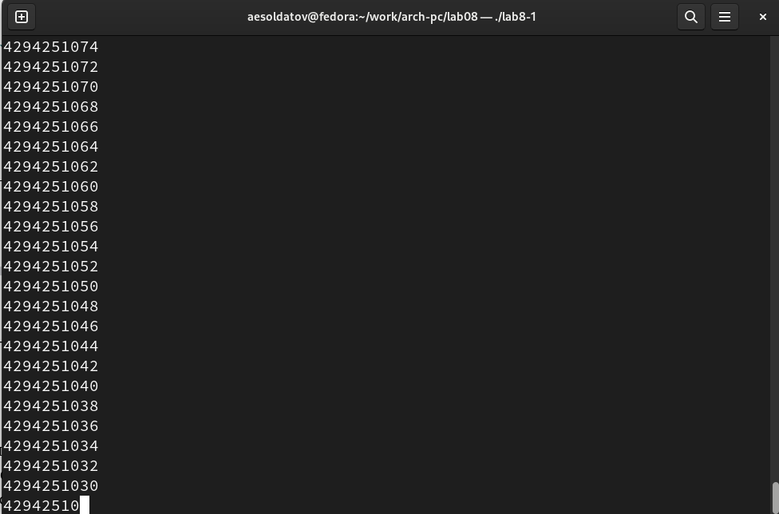{#fig:006-1 width=70%}

Внес изменения в текст программы добавив команды push и pop (рис. @fig:007).

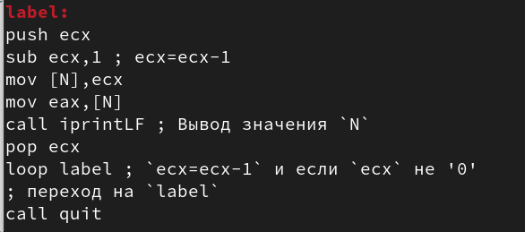{#fig:007 width=70%}

``` NASM
;-----------------------------------------------------------------
; Программа вывода значений регистра 'ecx'
;-----------------------------------------------------------------
%include 'in_out.asm'
SECTION .data
msg1 db 'Введите N: ',0h
SECTION .bss
N: resb 10
SECTION .text
global _start
_start:
; ----- Вывод сообщения 'Введите N: '
mov eax,msg1
call sprint
; ----- Ввод 'N'
mov ecx, N
mov edx, 10
call sread
; ----- Преобразование 'N' из символа в число
mov eax,N
call atoi
mov [N],eax
; ------ Организация цикла
mov ecx,[N] ; Счетчик цикла, `ecx=N`
label:
push ecx
sub ecx,1 ; ecx=ecx-1
mov [N],ecx
mov eax,[N]
call iprintLF ; Вывод значения `N`
pop ecx
loop label ; `ecx=ecx-1` и если `ecx` не '0'
; переход на `label`
call quit
```

Создал исполняемый файл и запустил его, в данном случае число проходов соответствует значению N, введенному с клавиатуры (рис. @fig:008).

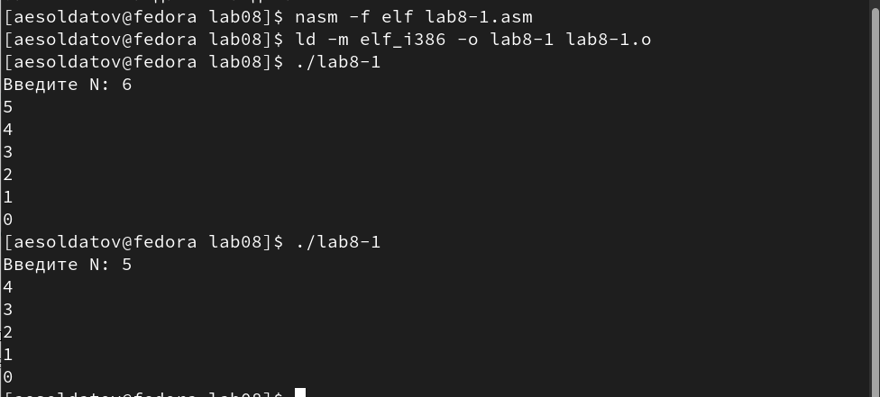{#fig:008 width=70%}

## Обработка аргументов командной строки

Создал файл "lab8-2.asm" в каталоге "~/work/arch-pc/lab08" (рис. @fig:009).

{#fig:009 width=70%}

Внимательно изучил текст программы из листинга 8.2 и ввел его в файл (рис. @fig:010).

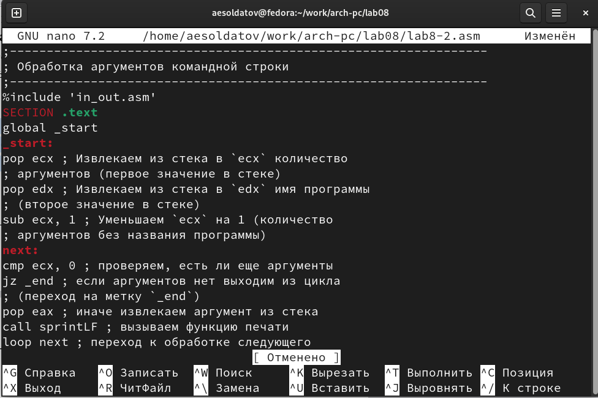{#fig:010 width=70%}

``` NASM
;-----------------------------------------------------------------
; Обработка аргументов командной строки
;-----------------------------------------------------------------
%include 'in_out.asm'
SECTION .text
global _start
_start:
pop ecx ; Извлекаем из стека в `ecx` количество
; аргументов (первое значение в стеке)
pop edx ; Извлекаем из стека в `edx` имя программы
; (второе значение в стеке)
sub ecx, 1 ; Уменьшаем `ecx` на 1 (количество
; аргументов без названия программы)
next:
cmp ecx, 0 ; проверяем, есть ли еще аргументы
jz _end ; если аргументов нет выходим из цикла
; (переход на метку `_end`)
pop eax ; иначе извлекаем аргумент из стека
call sprintLF ; вызываем функцию печати
loop next ; переход к обработке следующего
; аргумента (переход на метку `next`)
_end:
call quit
```

Создал исполняемый файл и проверил его работу указав аргументы из примера. Программа обработала 4 аргумента (рис. @fig:011).

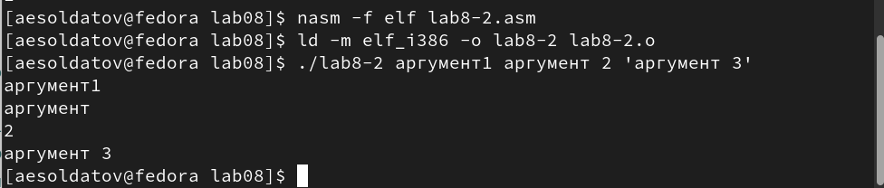{#fig:011 width=70%}

Создал файл "lab8-3.asm" в каталоге "~/work/arch-pc/lab08" (рис. @fig:012).

{#fig:012 width=70%}

Ввел в него текст программы из листинга 8.3 со страницы в ТУИС (рис. @fig:013).

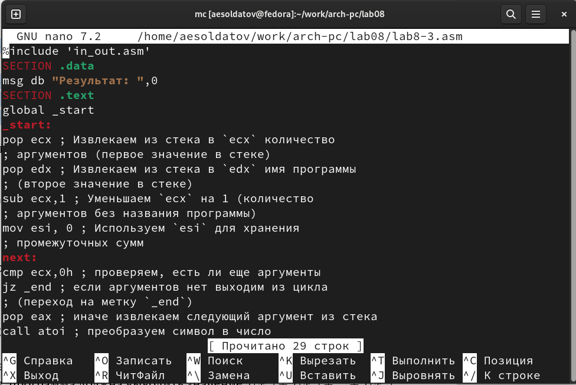{#fig:013 width=70%}

``` NASM
%include 'in_out.asm'
SECTION .data
msg db "Результат: ",0
SECTION .text
global _start
_start:
pop ecx ; Извлекаем из стека в `ecx` количество
; аргументов (первое значение в стеке)
pop edx ; Извлекаем из стека в `edx` имя программы
; (второе значение в стеке)
sub ecx,1 ; Уменьшаем `ecx` на 1 (количество
; аргументов без названия программы)
mov esi, 0 ; Используем `esi` для хранения
; промежуточных сумм
next:
cmp ecx,0h ; проверяем, есть ли еще аргументы
jz _end ; если аргументов нет выходим из цикла
; (переход на метку `_end`)
pop eax ; иначе извлекаем следующий аргумент из стека
call atoi ; преобразуем символ в число
add esi,eax ; добавляем к промежуточной сумме
; след. аргумент `esi=esi+eax`
loop next ; переход к обработке следующего аргумента
_end:
mov eax, msg ; вывод сообщения "Результат: "
call sprint
mov eax, esi ; записываем сумму в регистр `eax`
call iprintLF ; печать результата
call quit ; завершение программ
```

Создал исполняемый файл и запустил его, указав аргументы из примера. Программа работает корректно (рис. @fig:014).

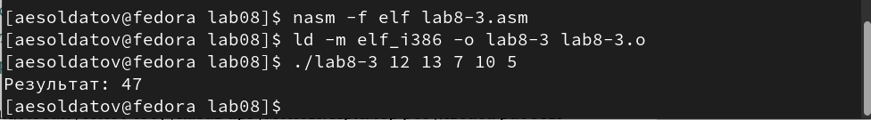{#fig:014 width=70%}

Изменил текст программы для вычисления произведения аргументов (рис. @fig:015).

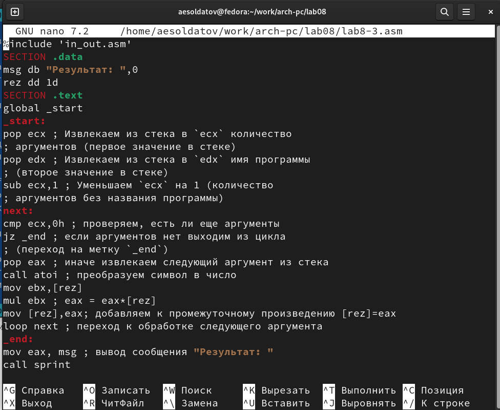{#fig:015 width=70%}

``` NASM
%include 'in_out.asm'
SECTION .data
msg db "Результат: ",0
rez dd 1d
SECTION .text
global _start
_start:
pop ecx ; Извлекаем из стека в `ecx` количество
; аргументов (первое значение в стеке)
pop edx ; Извлекаем из стека в `edx` имя программы
; (второе значение в стеке)
sub ecx,1 ; Уменьшаем `ecx` на 1 (количество
; аргументов без названия программы)
next:
cmp ecx,0h ; проверяем, есть ли еще аргументы
jz _end ; если аргументов нет выходим из цикла
; (переход на метку `_end`)
pop eax ; иначе извлекаем следующий аргумент из стека
call atoi ; преобразуем символ в число
mov ebx,[rez]
mul ebx ; eax = eax*[rez]
mov [rez],eax; добавляем к промежуточному произведению [rez]=eax
loop next ; переход к обработке следующего аргумента
_end:
mov eax, msg ; вывод сообщения "Результат: "
call sprint
mov eax, [rez] ; записываем произведение в регистр `eax`
call iprintLF ; печать результата
call quit ; завершение программы
```

Создал и проверил его работу (рис. @fig:016).

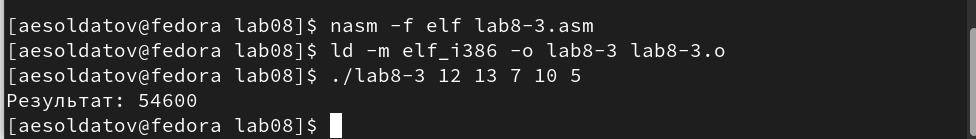{#fig:016 width=70%}

## Выполнение заданий для самостоятельной работы

Создал файл "samrab.asm" (рис. @fig:017).

{#fig:017 width=70%}

Написал программу нахождения суммы значений функций для разных переменных (рис. @fig:018).

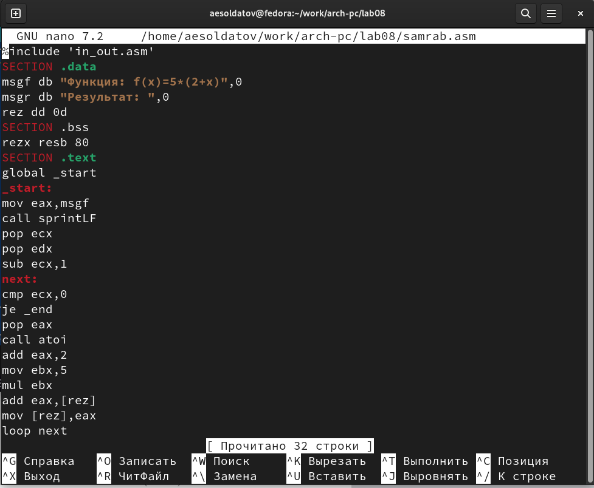{#fig:018 width=70%}

``` NASM
%include 'in_out.asm'
SECTION .data
msgf db "Функция: f(x)=5*(2+x)",0
msgr db "Результат: ",0
rez dd 0d
SECTION .bss
rezx resb 80
SECTION .text
global _start
_start:
mov eax,msgf
call sprintLF
pop ecx
pop edx
sub ecx,1
next:
cmp ecx,0
je _end
pop eax
call atoi
add eax,2
mov ebx,5
mul ebx
add eax,[rez]
mov [rez],eax
loop next
_end:
mov eax,msgr
call sprint
mov eax,[rez]
call iprintLF
call quit
```

Создал исполняемый файл и проверил его работу на нескольких наборах переменных (рис. [-@fig:019]).

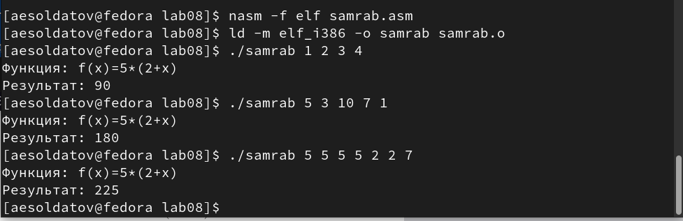{#fig:019 width=70%}

# Выводы

Приобрел навыки написания программ с использованием циклов и обработкой аргументов командной строки.

# Список литературы{.unnumbered}

::: {#refs}
:::
