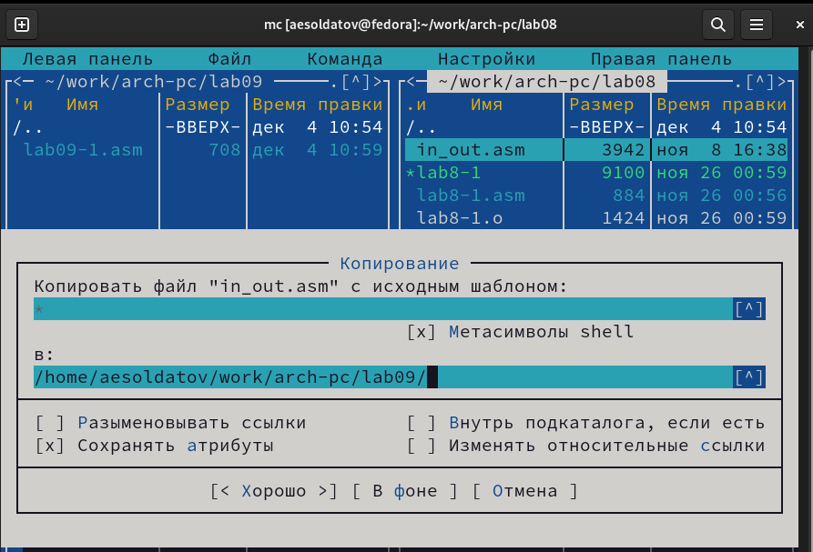

---
## Front matter
title: "Лабораторная работа №9"
subtitle: "Понятие подпрограммы. Отладчик GDB."
author: "Солдатов Алексей"

## Generic otions
lang: ru-RU
toc-title: "Содержание"

## Bibliography
bibliography: bib/cite.bib
csl: pandoc/csl/gost-r-7-0-5-2008-numeric.csl

## Pdf output format
toc: true # Table of contents
toc-depth: 2
lof: true # List of figures
lot: true # List of tables
fontsize: 12pt
linestretch: 1.5
papersize: a4
documentclass: scrreprt
## I18n polyglossia
polyglossia-lang:
  name: russian
  options:
	- spelling=modern
	- babelshorthands=true
polyglossia-otherlangs:
  name: english
## I18n babel
babel-lang: russian
babel-otherlangs: english
## Fonts
mainfont: PT Serif
romanfont: PT Serif
sansfont: PT Sans
monofont: PT Mono
mainfontoptions: Ligatures=TeX
romanfontoptions: Ligatures=TeX
sansfontoptions: Ligatures=TeX,Scale=MatchLowercase
monofontoptions: Scale=MatchLowercase,Scale=0.9
## Biblatex
biblatex: true
biblio-style: "gost-numeric"
biblatexoptions:
  - parentracker=true
  - backend=biber
  - hyperref=auto
  - language=auto
  - autolang=other*
  - citestyle=gost-numeric
## Pandoc-crossref LaTeX customization
figureTitle: "Рис."
tableTitle: "Таблица"
listingTitle: "Листинг"
lofTitle: "Список иллюстраций"
lotTitle: "Список таблиц"
lolTitle: "Листинги"
## Misc options
indent: true
header-includes:
  - \usepackage{indentfirst}
  - \usepackage{float} # keep figures where there are in the text
  - \floatplacement{figure}{H} # keep figures where there are in the text
---

# Цель работы

Приобрести навыки написания программ с использованием подпрограмм. Познакомиться с методами отладки при помощи GDB и его основными возможностями.

# Задание

1. Реализация подпрограмм в NASM
2. Отладка программ с помощью GDB
3. Выполнение заданий для самостоятельной работы

# Теоретическое введение

Здесь описываются теоретические аспекты, связанные с выполнением работы.

Например, в табл. @tbl:std-dir приведено краткое описание стандартных каталогов Unix.

: Описание некоторых каталогов файловой системы GNU Linux {#tbl:std-dir}

| Имя каталога | Описание каталога                                                                                                          |
|--------------|----------------------------------------------------------------------------------------------------------------------------|
| `/`          | Корневая директория, содержащая всю файловую                                                                               |
| `/bin `      | Основные системные утилиты, необходимые как в однопользовательском режиме, так и при обычной работе всем пользователям     |
| `/etc`       | Общесистемные конфигурационные файлы и файлы конфигурации установленных программ                                           |
| `/home`      | Содержит домашние директории пользователей, которые, в свою очередь, содержат персональные настройки и данные пользователя |
| `/media`     | Точки монтирования для сменных носителей                                                                                   |
| `/root`      | Домашняя директория пользователя  `root`                                                                                   |
| `/tmp`       | Временные файлы                                                                                                            |
| `/usr`       | Вторичная иерархия для данных пользователя                                                                                 |

Более подробно об Unix см. в [@gnu-doc:bash;@newham:2005:bash;@zarrelli:2017:bash;@robbins:2013:bash;@tannenbaum:arch-pc:ru;@tannenbaum:modern-os:ru].

# Выполнение лабораторной работы

## Реализация подпрограмм в NASM

Создал каталог для программ лабораторной работы №9, перешел в него и создал файл "lab9-1.asm" (рис. @fig:001).

{#fig:001 width=70%}

Внимательно изучил текст программы из листинга 9.1 со страницы в ТУИС и ввел в файл "lab9-1.asm" текст программы (рис. @fig:002).

{#fig:002 width=70%}

``` NASM
%include 'in_out.asm
SECTION .data
msg: DB 'Введите x: ',0
result: DB '2x+7=',0
SECTION .bss
x: RESB 80
res: RESB 80
SECTION .text
GLOBAL _start
_start:
;------------------------------------------
; Основная программа
;------------------------------------------
mov eax, msg
call sprint
mov ecx, x
mov edx, 80
call sread
mov eax,x
call atoi
call _calcul ; Вызов подпрограммы _calcul
mov eax,result
call sprint
mov eax,[res]
call iprintLF
call quit
;------------------------------------------
; Подпрограмма вычисления
; выражения "2x+7"
_calcul:
mov ebx,2
mul ebx
add eax,7
mov [res],eax
ret ; выход из подпрограммы
```

Перенес файл "in_out.asm" из прошлой папки с лабораторной работой в нынешнюю (рис. @fig:003).

{#fig:003 width=70%}

Создал исполняемый файл и запустил его (рис. @fig:004).

{#fig:004 width=70%}

Далее изменил текст программы добавив подпрограмму "_subcalcul" в подпрограмму "_calcul" согласно заданию (рис. @fig:005).

{#fig:005 width=70%}

``` NASM
%include 'in_out.asm'
SECTION .data
msg: DB 'Введите x: ',0
result: DB '2*(3x-1)+7=',0
SECTION .bss
x: RESB 80
res: RESB 80
SECTION .text
GLOBAL _start
_start:
;------------------------------------------
; Основная программа
;------------------------------------------
mov eax, msg
call sprint
mov ecx, x
mov edx, 80
call sread
mov eax,x
call atoi
call _calcul ; Вызов подпрограммы _calcul
mov eax,result
call sprint
mov eax,[res]
call iprintLF
call quit
;------------------------------------------
; Подпрограмма вычисления
; выражения "2x+7"_calcul:
call _subcalcul
mov ebx,2
mul ebx
add eax,7
mov [res],eax
ret ; выход из подпрограммы
_subcalcul:
mov ebx,3
mul ebx
add eax,-1
ret
```

Создал исполняемый файл и запустил его, все работает как надо (рис. @fig:008).

{#fig:008 width=70%}

## Отладка программ с помощью GDB

Создал файл "lab9-2.asm" в каталоге "~/work/arch-pc/lab09" (рис. @fig:009).

{#fig:009 width=70%}

Внимательно изучил текст программы из листинга 9.2 и ввел его в файл (рис. @fig:010).

{#fig:010 width=70%}

``` NASM
SECTION .data
msg1: db "Hello, ",0x0
msg1Len: equ $ - msg1
msg2: db "world!",0xa
msg2Len: equ $ - msg2
SECTION .text
global _start
_start:
mov eax, 4
mov ebx, 1
mov ecx, msg1
mov edx, msg1Len
int 0x80
mov eax, 4
mov ebx, 1
mov ecx, msg2
mov edx, msg2Len
int 0x80
mov eax, 1
mov ebx, 0
int 0x80
```

Создал исполняемый файл с отладочной информацией, загрузил его в отладчик gdb и проверил его работу, запустив в оболочке gdb, с помощью команды "run". Программа вывела "Hello, world!" (рис. @fig:011).

{#fig:011 width=70%}

Для более подробного анализа программы установил брейкпоинт на метку "_start" и запустил отладку (рис. @fig:012).

{#fig:012 width=70%}

Посмотрел дисассимилированный код программы с помощью команды "disassemble" начиная с метки _start (рис. @fig:013).

{#fig:013 width=70%}

Переключился на отображение команд с Intel’овским синтаксисом, введя команду "set disassembly-flavor intel" (рис. @fig:014).

{#fig:014 width=70%}

Различия отображения синтаксиса машинных команд в режимах ATT и Intel:

1. Порядок операндов (в режиме ATT начала источник, потом приемник, а в Intel сначала приемник, потом источник)
2. Отсутствие специальных символов ($, %) в Intel

Включил режим псевдографики для более удобного анализа программы (рис. @fig:015).

{#fig:015 width=70%}

Проверил работу команды "info breakpoints" (рис. @fig:016).

{#fig:016 width=70%}

Установил еще одну точку останова по адресу инструкции и проверил информацию о всех установленных точках останова (рис. @fig:017).

{#fig:017 width=70%}

Выполнил 5 инструкций с помощью команды "stepi" и проследил за изменением значений регистров (рис. @fig:018).

{#fig:018 width=70%}

Изменились значения регистров eax, ebx, ecx, edx

Посмотрел содержимое регистров с помощью команды "info registers" (рис. @fig:019).

{#fig:019 width=70%}

Посмотрите значение переменной "msg1" по имени и посмотрел значение переменной "msg2" по адресу. Адрес переменной определил по дизассемблированной инструкции (рис. @fig:020).

{#fig:020 width=70%}

Изменил первый символ переменной "msg1" (рис. @fig:021).

{#fig:021 width=70%}

Изменил первый символ переменной "msg2" (рис. @fig:022).

{#fig:022 width=70%}

Вывел в различных форматах (в шестнадцатеричном формате, в двоичном формате и в символьном виде) значение регистра edx (рис. @fig:023).

{#fig:023 width=70%}

С помощью команды "set" измените значение регистра ebx (рис. @fig:024).

{#fig:024 width=70%}

Значение регистра отличаются,так как в первом случае мы выводим код символа 2, который в десятичной системе счисления равен 50, а во втором случае выводится число 2, представленное в этой же системе.

Завершаю выполнение программы с помощью команды "continue" и выхожу из GDB с помощью команды "quit"

Скопировал файл lab8-2.asm, созданный при выполнении лабораторной работы №8, с программой выводящей на экран аргументы командной строки в файл с именем lab09-3.asm и создал исполняемый файл. Загрузил исполняемый файл в отладчик, указав аргументы (рис. @fig:025).

{#fig:025 width=70%}

Поставил точку останова перед первой инструкцией в программе и запустил ее (рис. @fig:026).

{#fig:026 width=70%}

Просмотрел адрес вершины стека, который хранится в регистре esp, а также другие позиции стека - по адресу (рис. @fig:027).

{#fig:027 width=70%}

Количество аргументов командной строки 4, поэтому шаг равен четырем.

## Выполнение заданий для самостоятельной работы

Создал файл "samrab1.asm", скопировав файл из прошлой лабораторной работы (рис. @fig:028).

{#fig:028 width=70%}

Преобразовал программу из лабораторной работы №8, реализовав вычисление значения функции как подпрограмму (рис. @fig:029).

{#fig:029 width=70%}

``` NASM
%include 'in_out.asm'
SECTION .data
msgf db "Функция: f(x)=5*(2+x)",0
msgr db "Результат: ",0
rez dd 0d
SECTION .bss
rezx resb 80
SECTION .text
global _start
_start:
mov eax,msgf
call sprintLF
pop ecx
pop edx
sub ecx,1
next:
cmp ecx,0
je _end
pop eax
call atoi
call _calculation
loop next
_end:
mov eax,msgr
call sprint
mov eax,[rez]
call iprintLF
call quit
_calculation:
add eax,2
mov ebx,5
mul ebx
add eax,[rez]
mov [rez],eax
ret
```

Создал исполняемый файл и проверил его работу (рис. -@fig:030).

{#fig:030 width=70%}

Создал файл "samrab2.asm" (рис. @fig:031).

{#fig:031 width=70%}

Ввел текст программы из листинга 9.3 со страницы в ТУИС (рис. @fig:032).

{#fig:032 width=70%}

``` NASM
%include 'in_out.asm'
SECTION .data
div: DB 'Результат: ',0
SECTION .text
GLOBAL _start
_start:
; ---- Вычисление выражения (3+2)*4+5
mov ebx,3
mov eax,2
add ebx,eax
mov ecx,4
mul ecx
add ebx,5
mov edi,ebx
; ---- Вывод результата на экран
mov eax,div
call sprint
mov eax,edi
call iprintLF
call quit
```

Создал исполняемый файл и проверил его работу, программа действительно выдает неверный результат (рис. -@fig:033).

{#fig:033 width=70%}

Просмотрел дисассемблированный код программы, поставил точку останова перед прибавлением 5 и открываю значения регистров на данном этапе (рис. -@fig:034).

{#fig:034 width=70%}

Как можно увидеть, регистр ecx со значением 4 умножается не на ebx, сложенным c eax, а только с eax со значением 2. Значит нужно поменять значения регистров (например присвоить eax значение 3 и просто прибавить 2).

После изменений программа будет выглядеть следующим образом: (рис. -@fig:035).

{#fig:035 width=70%}

``` NASM
%include 'in_out.asm'
SECTION .data
div: DB 'Результат: ',0
SECTION .text
GLOBAL _start
_start:
; ---- Вычисление выражения (3+2)*4+5
mov eax,3
mov ebx,2
add eax,ebx
mov ecx,4
mul ecx
add eax,5
mov edi,eax
; ---- Вывод результата на экран
mov eax,div
call sprint
mov eax,edi
call iprintLF
call quit
```

Создал исполняемый файл и проверил его работу, теперь программа работает как надо (рис. -@fig:036).

{#fig:036 width=70%}

# Выводы

Приобрел навыки написания программ с использованием подпрограмм. Познакомился с методами отладки при помощи GDB и его основными возможностями.

# Список литературы{.unnumbered}

::: {#refs}
:::
