---
## Front matter
title: "Лабораторная работа №10"
subtitle: "Работа с файлами средствами Nasm"
author: "Солдатов Алексей"

## Generic otions
lang: ru-RU
toc-title: "Содержание"

## Bibliography
bibliography: bib/cite.bib
csl: pandoc/csl/gost-r-7-0-5-2008-numeric.csl

## Pdf output format
toc: true # Table of contents
toc-depth: 2
lof: true # List of figures
lot: true # List of tables
fontsize: 12pt
linestretch: 1.5
papersize: a4
documentclass: scrreprt
## I18n polyglossia
polyglossia-lang:
  name: russian
  options:
	- spelling=modern
	- babelshorthands=true
polyglossia-otherlangs:
  name: english
## I18n babel
babel-lang: russian
babel-otherlangs: english
## Fonts
mainfont: PT Serif
romanfont: PT Serif
sansfont: PT Sans
monofont: PT Mono
mainfontoptions: Ligatures=TeX
romanfontoptions: Ligatures=TeX
sansfontoptions: Ligatures=TeX,Scale=MatchLowercase
monofontoptions: Scale=MatchLowercase,Scale=0.9
## Biblatex
biblatex: true
biblio-style: "gost-numeric"
biblatexoptions:
  - parentracker=true
  - backend=biber
  - hyperref=auto
  - language=auto
  - autolang=other*
  - citestyle=gost-numeric
## Pandoc-crossref LaTeX customization
figureTitle: "Рис."
tableTitle: "Таблица"
listingTitle: "Листинг"
lofTitle: "Список иллюстраций"
lotTitle: "Список таблиц"
lolTitle: "Листинги"
## Misc options
indent: true
header-includes:
  - \usepackage{indentfirst}
  - \usepackage{float} # keep figures where there are in the text
  - \floatplacement{figure}{H} # keep figures where there are in the text
---

# Цель работы

Приобретение навыков написания программ для работы с файлами.

# Задание

1. Выполнение лабораторной работы
2. Выполнение заданий для самостоятельной работы

# Теоретическое введение

Здесь описываются теоретические аспекты, связанные с выполнением работы.

Например, в табл. @tbl:std-dir приведено краткое описание стандартных каталогов Unix.

: Описание некоторых каталогов файловой системы GNU Linux {#tbl:std-dir}

| Имя каталога | Описание каталога                                                                                                          |
|--------------|----------------------------------------------------------------------------------------------------------------------------|
| `/`          | Корневая директория, содержащая всю файловую                                                                               |
| `/bin `      | Основные системные утилиты, необходимые как в однопользовательском режиме, так и при обычной работе всем пользователям     |
| `/etc`       | Общесистемные конфигурационные файлы и файлы конфигурации установленных программ                                           |
| `/home`      | Содержит домашние директории пользователей, которые, в свою очередь, содержат персональные настройки и данные пользователя |
| `/media`     | Точки монтирования для сменных носителей                                                                                   |
| `/root`      | Домашняя директория пользователя  `root`                                                                                   |
| `/tmp`       | Временные файлы                                                                                                            |
| `/usr`       | Вторичная иерархия для данных пользователя                                                                                 |

Более подробно об Unix см. в [@gnu-doc:bash;@newham:2005:bash;@zarrelli:2017:bash;@robbins:2013:bash;@tannenbaum:arch-pc:ru;@tannenbaum:modern-os:ru].

# Выполнение лабораторной работы

Создал каталог для программ лабораторной работы №10, перешел в него и создал файл "lab10-1.asm", "readme-1.txt" и "readme-2.txt" (рис. @fig:001).

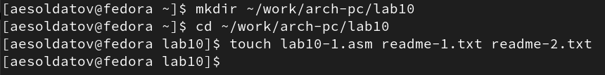{#fig:001 width=70%}

Внимательно изучил текст программы из листинга 10.1 со страницы в ТУИС и ввел в файл "lab10-1.asm" текст программы (рис. @fig:002).

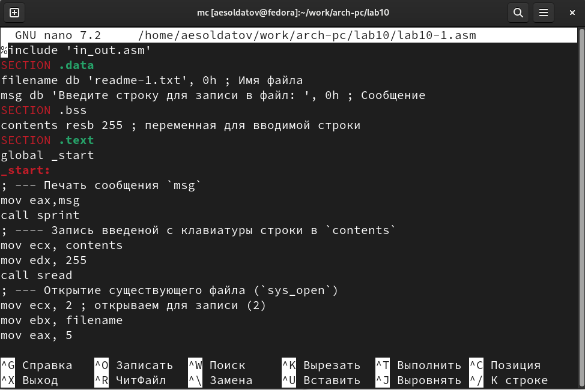{#fig:002 width=70%}

``` NASM
%include 'in_out.asm'
SECTION .data
filename db 'readme-1.txt', 0h ; Имя файла
msg db 'Введите строку для записи в файл: ', 0h ; Сообщение
SECTION .bss
contents resb 255 ; переменная для вводимой строки
SECTION .text
global _start
_start:
; --- Печать сообщения `msg`
mov eax,msg
call sprint
; ---- Запись введеной с клавиатуры строки в `contents`
mov ecx, contents
mov edx, 255
call sread
; --- Открытие существующего файла (`sys_open`)
mov ecx, 2 ; открываем для записи (2)
mov ebx, filename
mov eax, 5
int 80h
; --- Запись дескриптора файла в `esi`
mov esi, eax
; --- Расчет длины введенной строки
mov eax, contents ; в `eax` запишется количество
call slen ; введенных байтов
; --- Записываем в файл `contents` (`sys_write`)
mov edx, eax
mov ecx, contents
mov ebx, esi
mov eax, 4
int 80h
; --- Закрываем файл (`sys_close`)
mov ebx, esi
mov eax, 6
int 80h
call quit
```

Перенес файл "in_out.asm" из прошлой папки с лабораторной работой в нынешнюю (рис. @fig:003).

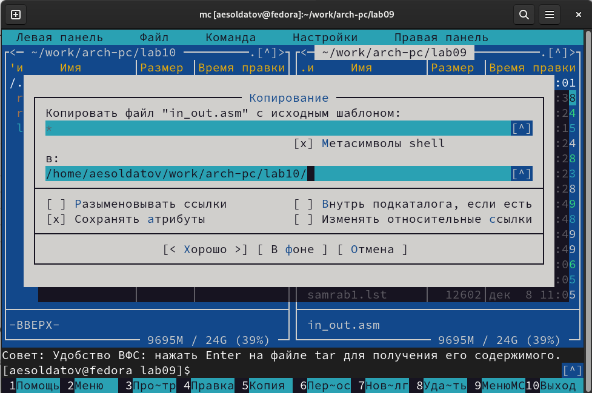{#fig:003 width=70%}

Создал исполняемый файл и проверил его работу (рис. @fig:004).

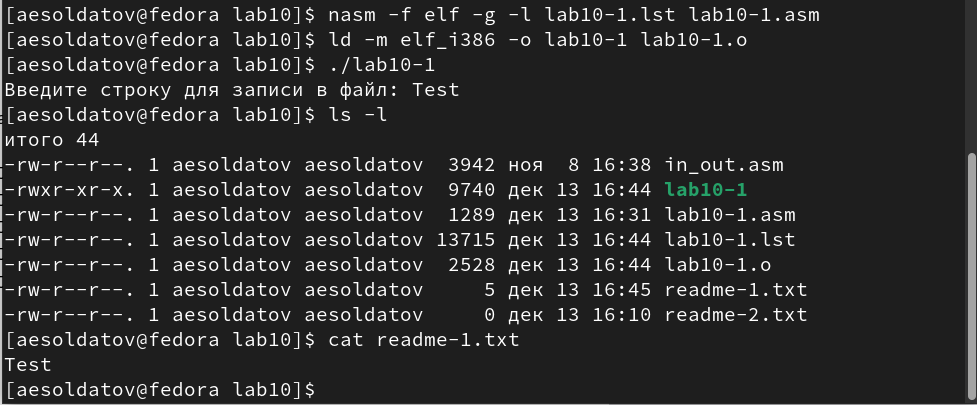{#fig:004 width=70%}

С помощью команды chmod изменил права доступа к исполняемому файлу "lab10-1", запретив его выполнение (рис. @fig:005).

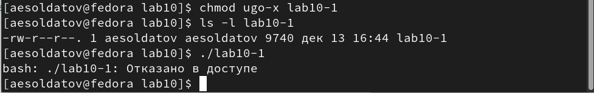{#fig:005 width=70%}

Из-за запрета на выполнение, при попытке запустить файл система отказывает в доступе

С помощью команды chmod изменил права доступа к исполняемому файлу "lab10-1.asm" с исходным текстом программы, добавив права на выполнение и попытался его выполнить (рис. @fig:006).

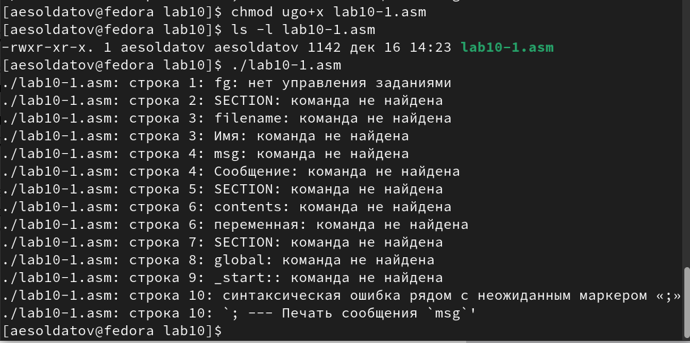{#fig:006 width=70%}

Из-за того, что производится попытка исполнить asm-файл, система не может распознать команды, которые там прописаны.

В соответствии со своим вариантом (10) в таблице 10.4 предоставил права доступа к файлу "readme-1.txt" представленные в символьном виде, а для файла readme-2.txt – в двочном виде (рис. @fig:007).

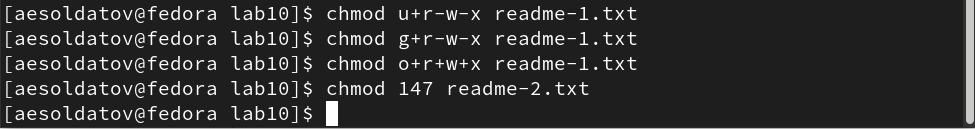{#fig:007 width=70%}

Проверил правильность выполнения с помощью команды ls -l (рис. @fig:008).

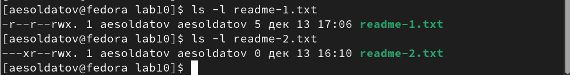{#fig:008 width=70%}

# Выполнение заданий для самостоятельной работы

Создал файл "samrab.asm" (рис. @fig:009).

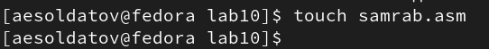{#fig:009 width=70%}

Написал код программы который работает по алгоритму из задания (рис. @fig:010).

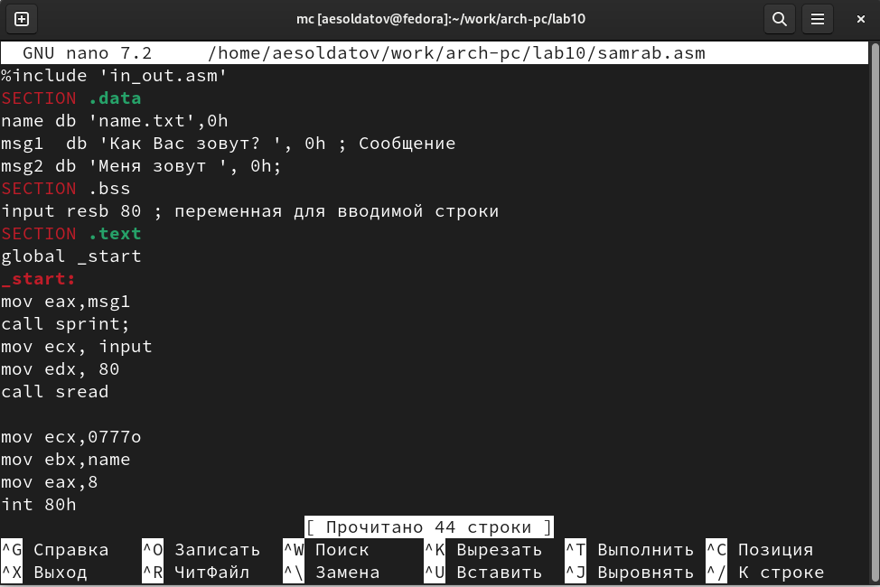{#fig:010 width=70%}

``` NASM
%include 'in_out.asm'
SECTION .data
name db 'name.txt',0h
msg1  db 'Как Вас зовут? ', 0h ; Сообщение
msg2 db 'Меня зовут ', 0h;
SECTION .bss
input resb 80 ; переменная для вводимой строки
SECTION .text
global _start
_start:
mov eax,msg1
call sprint;
mov ecx, input
mov edx, 80
call sread

mov ecx,0777o
mov ebx,name
mov eax,8
int 80h


mov esi, eax


mov eax, input 
call slen 

mov edx,eax
mov ecx,msg2
mov ebx,esi
mov eax,4
int 80h

mov edx, eax
mov ecx, input
mov ebx, esi
mov eax, 4
int 80h

mov ebx, esi
mov eax, 6
int 80h
call quit
```

Создал исполняемый файл и проверил его работу, а также проверил наличие файла и его содержимое с помощью команд "ls" и "cat" (рис. @fig:011).

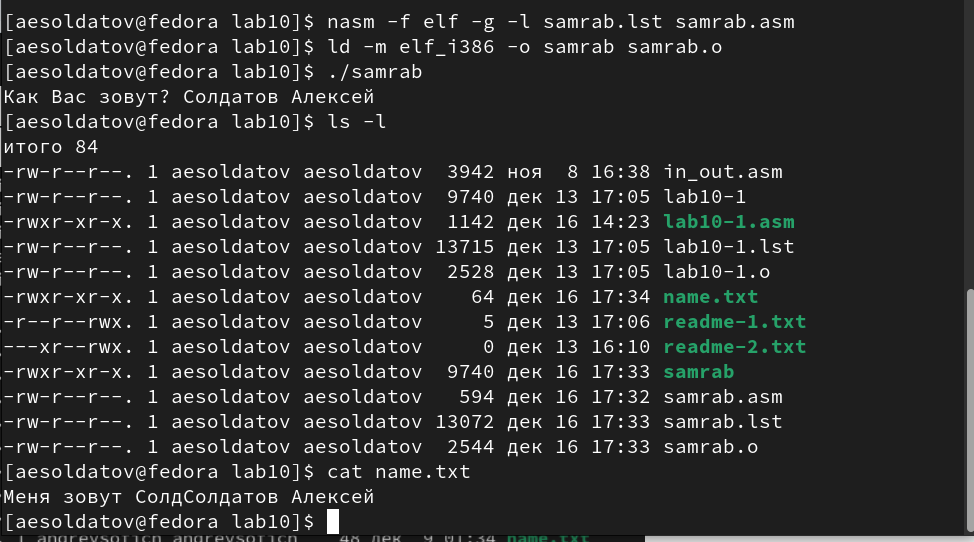{#fig:011 width=70%}

# Выводы

Приобрел навыки написания программ для работы с файлами.

# Список литературы{.unnumbered}

::: {#refs}
:::
